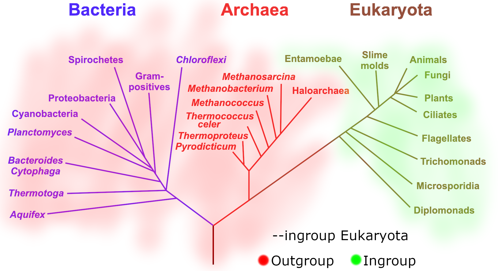
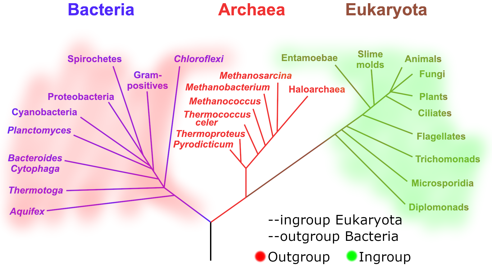
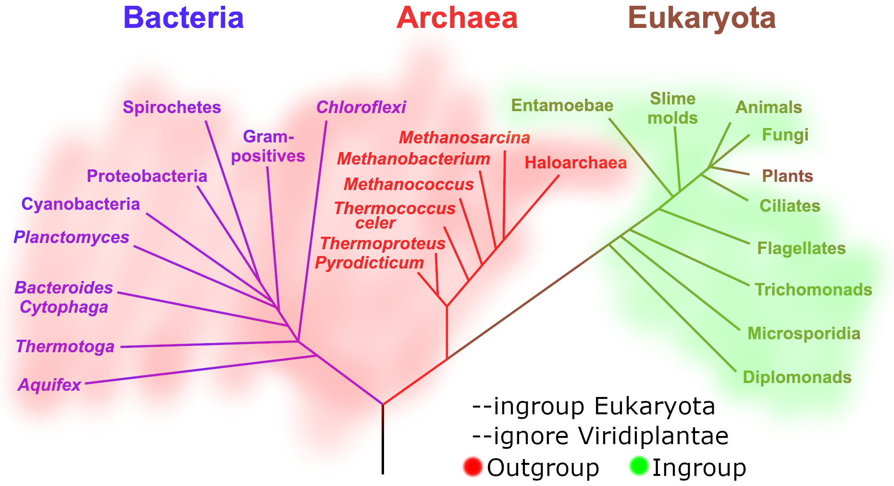
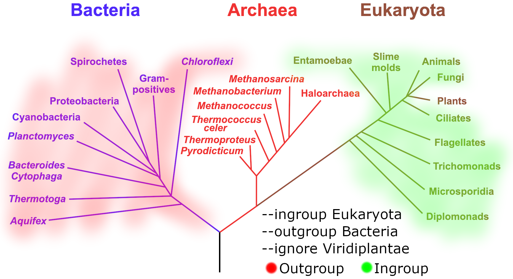

# Alien Index
## Introduction
This script parses a DIAMOND BLAST output file with taxonomic info and for each query sequence calculates the proportion of hits in user specified ingroup/outgroup and calculates the alien index, which is the difference in natural-log transformed e-values for the best ingroup and outgroup hits.
Comparative measurement of BLAST scores to indicate strength of evidence for horizontal gene transfer, by comparing best ingroup evalue with best outgroup evalue.

## Usage
Use script with DIAMOND BLAST results generated with this specific format. You must have a search database that was created with NCBI taxonomy information ([see here](https://github.com/bbuchfink/diamond/wiki/3.-Command-line-options#makedb-options)).
```
diamond blastp -d /home/fay-wei/bin/NCBI_db/nr_20200613.dmnd -q query.pep.fa -o query_diamond2nr.out --max-target-seqs 100 --outfmt 6 qseqid sseqid pident length mismatch gapopen qstart qend sstart send evalue bitscore staxids sskingdoms skingdoms sphylums sscinames
```
With your BLAST results, you can process in numerous ways. The most basic way sets the ingroup, and by default anything else is treated as outgroup.
```
E.g.
alienIndex.py --ingroup Eukaryota --file query_diamond2nr.out
alienIndex.py --ingroup Bacteria --file query_diamond2nr.out
alienIndex.py --ingroup Bryopsida --file query_diamond2nr.out
```


By default, results are printed to STDOUT. They can be written to a file by giving a filename after the `--output` flag, or with terminal redirection `>`. Output can also be piped e.g. `alienIndex.py --ingroup Bryopsida --file query_diamond2nr.out | sort -k 8,8n`.  

Output includes gene name, raw number of ingroup/outgroup hits, percentage of ingroup/outgroup hits, best ingroup/outgroup evalues, and the alien index. AI ranges from about +/- 460, with scores > 0 showing better outgroup score than ingroup. AI of 10-20 has been used as cutoff for conclusive evidence of ingroup/outgroup gene origin (see Citations). Output is not sorted by default, can be sorted by AI with:
```
# sort results file
sort -k 8,8n  query_diamond2nr.alienIndex.txt

# sort output directly from script
alienIndex.py --ingroup Eukaryota --file query_diamond2nr.out | sort -k 8,8n
```
You can see what ingroups are in your BLAST file, try:
```
# Superkingdom
cut -f 14 query_diamond2nr.out | sort | uniq

# Kingdom
cut -f 15 query_diamond2nr.out | sort | uniq

# Phylum
cut -f 16 query_diamond2nr.out | sort | uniq

# Genus
cut -f 17 query_diamond2nr.out | awk -F";| " '{print $1}' | sort | uniq
```
In rare cases, a taxonomic group's name might be used at multiple taxonomic levels. In this case, the `--taxon` parameter can be used to specify (superkingdom, kingdom, phylum, genus). Run `alienIndex.py --help` for more details.
```
Required parameters
	--ingroup, -i	Name of taxonomic ingroup. Can be at any taxonomic level listed below. Set --taxon to search only a particular taxonomic level (use if ingroup name is shared among multiple taxonomic levels)
	--file, -f	Diamond output file with format specified above
Optional parameters
	--outgroup, -g	Specify outgroup. If not set, all sequences not in the ingroup are treated as outgroup. Set this if you want to leave a 'gap' between ingroup and outgroup.
	--ignore, -n	Specify clade within the ingroup to ignore. E.g. Ingroup is Eukaryota, but do not consider hits to Polypodiopsida.
	--output, -o	Name of output file. If not specified, output is printed to stdout
	--missing, -m	How to treat N/A taxonomic annotations. Available options: 'ignore' (default), 'outgroup', 'ingroup.
	--help, -h	Display full usage
	--log, -l	File to write log containing warnings generated and offending lines in BLAST file for debugging. Does not affect what is printed to STDOUT.
	--taxon, -t	Usually not necessary to set. Taxonomic level for ingroup. Available options: 'superkingdom' , 'kingdom', 'phylum', 'genus'
```


## Advanced Usage
Several advanced parameters are available to let you tailor your ingroups and outgroups to include and ignore specific clades. They can occur at different taxonomic levels, but must be mutually exclusive (one group should not be nested in another).
1. The `--outgroup` parameter allows you to explicitly set an outgroup (opposed to default, where everything not in the ingroup is treated as outgroup). With this setting, all hits that do not fall in the ingroup or outgroup are ignored. An example command would look like:
```
alienIndex.py --ingroup Eukaryota --outgroup Bacteria --file query_diamond2nr.out
```



2. The `--ignore` parameter allows you to ignore hits that would otherwise be considered ingroup. This allows you to create polyphyletic ingroups, which may be desired if previously identified HGT genes are in your search database causing AI values for known HGT genes to be < 0. Example:
```
alienIndex.py --ingroup Eukaryota --ignore Viridiplantae --file query_diamond2nr.out
```



3. It is possible to combine --ignore and --outgroup to customize your search space even more.
```
alienIndex.py --ingroup Eukaryota --ignore Viridiplantae --outgroup Bacteria --file query_diamond2nr.out
```



4. The `--missing` parameter specifies how to treat missing taxonomic annotations in the DIAMOND database (where taxonomic results are "N/A"). Depending on how conservative you want to be, they can be ignored (default operation), considered to be outgroup members, or considered to be ingroup members. You may want to use this setting if you know the N/A annotations are likely to represent a certain taxonomic group.
```
alienIndex.py --missing ingroup --ingroup Eukaryota --file query_diamond2nr.out
alienIndex.py --missing outgroup --ingroup Eukaryota --file query_diamond2nr.out
alienIndex.py --missing ignore --ingroup Eukaryota --file query_diamond2nr.out
```
5. The `--taxon` parameter can be used to specify a particular level ('superkingdom' , 'kingdom', 'phylum', or 'genus') to search for the ingroup/outgroup name. Only applies to the BLAST file (representing 14th-17th columns). This should only be used if you expect the same name to be used at multiple taxonomic levels and you need to specify one (I don't know that this ever happens, this setting is just a precaution).
```
alienIndex.py --ingroup Bacteria --taxon superkingdom --file query_diamond2nr.out
```

## How it works
The script takes the BLAST results file, and creates a dictionary where each top-level key is the query sequences name (first column). Each entry contains info related to that query sequences:
* number of BLAST hits in the ingroup
* number in the outgroup
* result line for lowest ingroup e-value
* result line for lower outgroup e-value

In order to determine if each hit is a member of the ingroup or outgroup, it first tries to use the taxonomic info written in the BLAST file (14th-17th columns). If not found in those columns, the entire NCBI taxonomy tree is parsed, starting with the genus from the line and traversing up the hierarchy until the provided ingroup/outgroup name is found (or the root of the tree is reached). WARNING! Taxonomy traversal is much slower than default operation. In my tests, it processes about 800 lines/sec, so a reasonably sized 2.5M line BLAST file will take ~1 hour to process. So try to use superkingdom, kingdom, and phylum when possible. Note that entries with "N/A" or "synthetic" or "unclassified" in their 17th column Once the dictionary is completed, ingroup/outgroup percentages are calculated, and the AI is calculated, and everything is written to file or STDOUT.


## Citations
* Fan, X. et al. 2020. Phytoplankton pangenome reveals extensive prokaryotic horizontal gene transfer of diverse functions. <i>Sci. Adv.</i> 6 (18): eaba0111. [doi: 10.1126/sciadv.aba0111](https://advances.sciencemag.org/content/6/18/eaba0111)
* Gladyshev, E.A., M. Meselson, and A.R. Arkhipova. 2008. Massive horizontal gene transfer in bdelloid rotifers. <i>Science</i> 320 (5880): 1210-1213. [doi: 10.1126/science.1156407](https://science.sciencemag.org/content/320/5880/1210)
