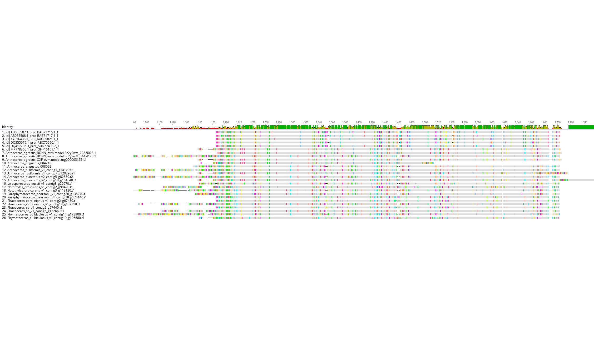

# Rosmarinic Acid Pathway
 Server Location: `/home/ps997/gene-analyses/rosmarinic_acid_synthesis`
RA biopsynthesis pathway with some related compounds:

### Download protein references from Petersen 2013, Wohl and Petersen 2020.
```
# PAL phenylalanine ammonia-lyase
efetch -db nucleotide -id EF462460,DQ408636,JQ277717,FN665700,AF326116,DQ445051,D83075,D83076 -format fasta > PAL_CDS_references.fasta
efetch -db nucleotide -id EF462460,DQ408636,JQ277717,FN665700,AF326116,DQ445051,D83075,D83076 -format fasta_cds_aa > PAL_PROT_references.fasta

# C4H Cinnamic acid 4-hydroxylase
efetch -db nucleotide -id AY616436,DQ355979,DQ417206,AB055507,AB055508,MK778366 -format fasta > C4H_CDS_references.fasta
efetch -db nucleotide -id AY616436,DQ355979,DQ417206,AB055507,AB055508,MK778366 -format fasta_cds_aa > C4H_PROT_references.fasta

# 4CL 4-coumaric acid CoA-ligase
efetch -db nucleotide -id AY237163,AY237164,FN665699,AY587891,DQ400697,D49366,D49367 -format fasta > 4CL_CDS_references.fasta
efetch -db nucleotide -id AY237163,AY237164,FN665699,AY587891,DQ400697,D49366,D49367 -format fasta_cds_aa > 4CL_PROT_references.fasta

# TAT tyrosine amino-transferase. Also includes refs (TATs and more distant aminotransferases) from Busch and Petersen 2021.
efetch -db nucleotide -id HQ221576,AJ458993,DQ334606,EF192320,KM053278,KF926689,KF926690,NM_124776,NM_123007,GU370929,XM_024680901 -format fasta > TAT_CDS_references.fasta
efetch -db nucleotide -id HQ221576,AJ458993,DQ334606,EF192320,KM053278,KF926689,KF926690,NM_124776,NM_123007,GU370929,XM_024680901 -format fasta_cds_aa > TAT_PROT_references.fasta
efetch -db protein -id GAQ85880,OAE18929,XP_024361307 -format fasta >> TAT_PROT_references.fasta
efetch -db protein -id AAO63403,AAP68293,Q9SIE1,BAA77261,Q9SR86,AAN62333,AAC50015,P46643,P46645,P46645,P46248,CAA70403,AHN10104 -format fasta> AT_PROT_references.fasta

# HPPR 4-hydroxyphenylpyruvate reductase
efetch -db nucleotide -id AJ507733,HM587131,DQ266514,EF458148,DQ099741 -format fasta > HPPR_CDS_references.fasta
efetch -db nucleotide -id AJ507733,HM587131,DQ266514,EF458148,DQ099741 -format fasta_cds_aa > HPPR_PROT_references.fasta

# RAS rosmarinic acid synthase
efetch -db nucleotide -id AM283092,FR670523,JF343521,FJ906696,GU647199 -format fasta > RAS_CDS_references.fasta
efetch -db nucleotide -id AM283092,FR670523,JF343521,FJ906696,GU647199 -format fasta_cds_aa > RAS_PROT_references.fasta

# 3H or 3'H or 3/3'H 3- and 3'-hydroxylation
efetch -db nucleotide -id AJ427452,HQ316179,AB017418,AY082611,AY082612 -format fasta > 3H_CDS_references.fasta
efetch -db nucleotide -id AJ427452,HQ316179,AB017418,AY082611,AY082612 -format fasta_cds_aa > 3H_PROT_references.fasta
```

### BLAST references against hornworts genomes/proteins
```
for i in *CDS_references.fasta ; do blastn -query $i -db ~/Hornwort_v1_genomes/All_hornwort_genomes.fasta -evalue 1e-10 -num_threads 12 -outfmt 6 -out "$i".All_hornwort_genomes.blastn ; done
for i in *PROT_references.fasta ; do blastp -query $i -db ~/Hornwort_v1_genomes/All_hornwort_proteins.20210406.faa -evalue 1e-10 -num_threads 12 -outfmt 6 -out "$i".All_hornwort_proteins.blastp ; done
```

### Results
#### PAL
All hornworts have at least 1 protein with >60% identity hit to references. All species have 2 genes with BLASTp hits except Notothylas (1) and Paraphymatoceros (3). All occur in OG0000307. Phylogeny shows two sister clades that reflect all hornwort phylogeny, PAL duplication along root of all hornworts.  


#### C4H
All hornworts have at least 1 protein with >60% identity hit to references (this gene includes the hornwort reference). All species have 2 genes with BLASTp hits except Anthoceros agrestis Oxford (1). All occur in OG0001427.


#### 4CL
All hornworts have at least 1 protein with >60% identity hit to references. Single-copy in Anthoceros agrestis Bonn and Oxford, A. fusiformis, Leiosporoceros, and Phaeoceros carolinianus. Two copies in Notothylas, Paraphymatoceros, Phaeoceros sp., and Phymatoceros. Most copies (including one from each species) occur in OG0000165. One copy from Phymatoceros occurs in OG0007474 and one copy from Phaeoceros sp. in OG0016454. In phylogeny clade with references contains fairly well resolved clades representing groups of land plants and algae.


#### RAS
All hornworts have at least 1 protein with >50% identity hit to references. Single-copy in all except Phaeoceros sp. All in OG0000015.


#### TAT
Single copy in all hornworts for bitscore > 500 (%ID > 60). Still mostly single copy for bitscore > 400 (but 2 copies in Notothylas). All in OG0001716.
```
awk -F"\t" '{if ($12 > 400) print $2}' TAT_PROT_references.fasta.All_hornwort_proteins.blastp | sort | uniq > TAT_hornwort_candidate_proteins.txt
for i in ~/hornwort-orthologs/orthofinder_in/OrthoFinder/Results_Jan21_1/Orthogroup_Sequences/* ; do grep -f TAT_hornwort_candidate_proteins.txt && echo $i ; done
cp ~/hornwort-orthologs/orthofinder_in/OrthoFinder/Results_Jan21_1/Orthogroup_Sequences/OG0001716.fasta TAT_OG0001716.fasta
cat TAT_OG0001716.fa TAT_PROT_references.fasta AT_PROT_references.fasta > TAT_AT_all_seqs.fa
removeDuplicateSeqFasta.py TAT_AT_all_seqs.fa
clustalo --auto --threads 12 -i TAT_AT_all_seqs.dupSeqsCombined.fasta -o TAT_AT_all_seqs.CLUSTAL.fa
~/bin/trimal-run -in TAT_AT_all_seqs.CLUSTAL.fa -out TAT_AT_all_seqs.CLUSTAL.TRIMAL.fa -automated1
```


#### HPPR
All with bitscores >300 (>50% identity of hits). All with 2 copies, all in OG0000704.


#### 3H/3'H
All hornworts have at least one protein with >500 bitscore or a >50% identity hit. All single copy except Phaeoceros carolinianus. All in OG0000001. In prelim phyogeny, clade containing refs and hornworts has sequences in 3H_focal_clade.fa.


### Gene Table
|                                 | PAL | C4H-1 | C4H-2 | 4CL | TAT | HPPR | RAS | 3H/3'H |
|---------------------------------|-----|-------|-------|-----|-----|------|-----|--------|
| <i>Anthoceros agrestis</i> BONN | Anthoceros_agrestis_BONN_evm.model.Sc2ySwM_228.5205.1, Anthoceros_agrestis_BONN_evm.model.Sc2ySwM_228.725.1 | Anthoceros_agrestis_BONN_evm.model.Sc2ySwM_228.5028.1 | Anthoceros_agrestis_BONN_evm.model.Sc2ySwM_344.4128.1 | Anthoceros_agrestis_BONN_evm.model.Sc2ySwM_362.900.1 | Anthoceros_agrestis_BONN_evm.model.Sc2ySwM_368.672.1 | Anthoceros_agrestis_BONN_evm.model.Sc2ySwM_117.4042.1, Anthoceros_agrestis_BONN_evm.model.Sc2ySwM_228.460.1, Anthoceros_agrestis_BONN_evm.model.Sc2ySwM_368.680.1 | Anthoceros_agrestis_BONN_evm.model.Sc2ySwM_362.596.1 | Anthoceros_agrestis_BONN_evm.model.Sc2ySwM_228.160.1 |
| <i>A. agrestis</i> OXFORD       | Anthoceros_agrestis_OXF_evm.model.utg000003l.75.1, Anthoceros_agrestis_OXF_evm.model.utg000011l.191.1 | Anthoceros_agrestis_OXF_evm.model.utg000003l.251.1 |    | Anthoceros_agrestis_OXF_evm.model.utg000004l.18.1 | Anthoceros_agrestis_OXF_evm.model.utg000017l.62.1 | Anthoceros_agrestis_OXF_evm.model.utg000061l.135.1, Anthoceros_agrestis_OXF_evm.model.utg000009l.178.1, Anthoceros_agrestis_OXF_evm.model.utg000017l.72.1 | Anthoceros_agrestis_OXF_evm.model.utg000133l.27.1 | Anthoceros_agrestis_OXF_evm.model.utg000009l.515.1 |
| <i>A. angustus</i>              | Anthoceros_angustus_009834, Anthoceros_angustus_007484 | Anthoceros_angustus_004216 | Anthoceros_angustus_008092 | Anthoceros_angustus_009153 | Anthoceros_angustus_012807 | Anthoceros_angustus_014279, Anthoceros_angustus_011470 | Anthoceros_angustus_009461 | Anthoceros_angustus_006992 |
| <i>A. fusiformis</i>            | Anthoceros_fusiformis_v1_contig7_g121730.t1, Anthoceros_fusiformis_v1_contig3_g51050.t1 | Anthoceros_fusiformis_v1_contig7_g120290.t1 | Anthoceros_fusiformis_v1_contig1_g14120.t2 | Anthoceros_fusiformis_v1_contig20_g195050.t1 | Anthoceros_fusiformis_v1_contig16_g184850.t1 | Anthoceros_fusiformis_v1_contig4_g81480.t1, Anthoceros_fusiformis_v1_contig16_g184920.t2 | Anthoceros_fusiformis_v1_contig19_g191740.t1 | Anthoceros_fusiformis_v1_contig3_g58310.t1 |
| <i>A. punctatus</i>             | Anthoceros_punctatus_v2_contig18_g159880.t1, Anthoceros_punctatus_v2_contig3_g53160.t1 | Anthoceros_punctatus_v2_contig18_g161640.t1 | Anthoceros_punctatus_v2_contig5_g82550.t2 | Anthoceros_punctatus_v2_contig7_g97540.t2 | Anthoceros_punctatus_v2_contig16_g151840.t2 | Anthoceros_punctatus_v2_contig37_g226530.t1, Anthoceros_punctatus_v2_contig3_g50610.t1, Anthoceros_punctatus_v2_contig16_g151960.t1 | Anthoceros_punctatus_v2_contig42_g207080.t1 | Anthoceros_punctatus_v2_contig3_g41160.t1 |
| <i>Leiosporoceros dussii</i>    | Leiosporoceros_dussii_v1_contig52_g93540.t1, Leiosporoceros_dussii_v1_contig66_g101540.t1 | Leiosporoceros_dussii_v1_contig53_g94530.t1 (fragment?) | Leiosporoceros_dussii_v1_contig8_g26670.t1 | Leiosporoceros_dussii_v1_contig16_g49460.t1 | Leiosporoceros_dussii_v1_contig22_g60440.t1 | Leiosporoceros_dussii_v1_contig45_g87660.t1, Leiosporoceros_dussii_v1_contig22_g60490.t1 | Leiosporoceros_dussii_v1_contig33_g75550.t1 | Leiosporoceros_dussii_v1_contig126_g117560.t1 |
| <i>Notothylas orbicularis</i>   | Notothylas_orbicularis_v1_contig2_g87710.t1 | Notothylas_orbicularis_v1_contig2_g98420.t1 | Notothylas_orbicularis_v1_contig3_g113120.t1 | Notothylas_orbicularis_v1_contig6_g204170.t1 | Notothylas_orbicularis_v1_contig1_g27100.t1, Notothylas_orbicularis_v1_contig4_g153720.t1 | Notothylas_orbicularis_v1_contig1_g02510.t1, Notothylas_orbicularis_v1_contig4_g153590.t1 | Notothylas_orbicularis_v1_contig6_g198730.t1 | Notothylas_orbicularis_v1_contig2_g63480.t2 |
| <i>Paraphymatoceros pearsonii</i>| Paraphymatoceros_pearsonii_v1_contig38_g175630.t1, Paraphymatoceros_pearsonii_v1_contig24_g129400.t1, Paraphymatoceros_pearsonii_v1_contig69_g224540.t1 | Paraphymatoceros_pearsonii_v1_contig38_g174140.t1 | Paraphymatoceros_pearsonii_v1_contig26_g138270.t1 | Paraphymatoceros_pearsonii_v1_contig13_g75880.t1 | Paraphymatoceros_pearsonii_v1_contig33_g160490.t1 | Paraphymatoceros_pearsonii_v1_contig9_g49920.t1, Paraphymatoceros_pearsonii_v1_contig33_g160370.t1 | Paraphymatoceros_pearsonii_v1_contig16_g93150.t1 | Paraphymatoceros_pearsonii_v1_contig41_g181240.t1 |
| <i>Pheaoceros carolinianus</i>  | Phaeoceros_carolinianus_v1_contig2_g69040.t1, Phaeoceros_carolinianus_v1_contig28_g206090.t1 | Phaeoceros_carolinianus_v1_contig2_g67480.t1 | Phaeoceros_carolinianus_v1_contig19_g187210.t1 | Phaeoceros_carolinianus_v1_contig11_g150980.t1 | Phaeoceros_carolinianus_v1_contig1_g35740.t1 | Phaeoceros_carolinianus_v1_contig7_g134030.t1, Phaeoceros_carolinianus_v1_contig1_g35690.t1 | Phaeoceros_carolinianus_v1_contig5_g109710.t1 | Phaeoceros_carolinianus_v1_contig45_g222460.t1, Phaeoceros_carolinianus_v1_contig49_g224850.t1 |
| <i>Phaeoceros sp.</i>           | Phaeoceros_sp_v1_contig2_g55690.t1, Phaeoceros_sp_v1_contig1_g19910.t1 | Phaeoceros_sp_v1_contig2_g57440.t1 | Phaeoceros_sp_v1_contig5_g132660.t1 | Phaeoceros_sp_v1_contig10_g212310.t1 | Phaeoceros_sp_v1_contig11_g217910.t1 | Phaeoceros_sp_v1_contig4_g120560.t1, Phaeoceros_sp_v1_contig4_g120240.t1, Phaeoceros_sp_v1_contig11_g217970.t1 | Phaeoceros_sp_v1_contig13_g231520.t1, Phaeoceros_sp_v1_contig20_g257320.t1 | Phaeoceros_sp_v1_contig7_g167950.t1 |
| <i>Phymatoceros bulbiculosus    | Phymatoceros_bulbiculosus_v1_contig19_g198220.t1, Phymatoceros_bulbiculosus_v1_contig1_g17670.t1 | Phymatoceros_bulbiculosus_v1_contig19_g196680.t1 | Phymatoceros_bulbiculosus_v1_contig14_g173900.t1 | Phymatoceros_bulbiculosus_v1_contig18_g193480.t1 | Phymatoceros_bulbiculosus_v1_contig10_g153280.t1 | Phymatoceros_bulbiculosus_v1_contig6_g112300.t1, Phymatoceros_bulbiculosus_v1_contig10_g153360.t1 | Phymatoceros_bulbiculosus_v1_contig21_g205820.t1 | Phymatoceros_bulbiculosus_v1_contig1_g34870.t1 |


### Gene Expression
Genes correspond to table above. Measurement is approximate reads per kilobase per million mapped reads (RPKM, includes any introns).  

|                                 | PAL | C4H-1 | C4H-2 | 4CL | TAT | HPPR | RAS | 3H/3'H |
|---------------------------------|-----|-------|-------|-----|-----|------|-----|--------|
| <i>Anthoceros agrestis</i> BONN | 14,144 |  221  |   28  |  52 |  35 | 26,5,18 | <a href="images/rosmarinic-acid-pathway/Anthoceros_agrestis_BONN_evm.model.Sc2ySwM_362.596.1_RAS_RNA_depth.png">6</a> | <a href="images/rosmarinic-acid-pathway/Anthoceros_agrestis_BONN_evm.model.Sc2ySwM_228.160.1_3H_RNA_depth.png">19</a> |
| <i>A. agrestis</i> OXFORD       | 47,53 |    5  |       |  78 |  65 | 11,7,59 | <a href="images/rosmarinic-acid-pathway/Anthoceros_agrestis_OXF_evm.model.utg000133l.27.1_RAS_RNA_depth.png">22</a> | <a href="images/rosmarinic-acid-pathway/Anthoceros_agrestis_OXF_evm.model.utg000009l.515.1_3H_RNA_depth.png">28</a> |
| <i>A. angustus</i>              |     |       |       |     |     |      |     |        |
| <i>A. fusiformis</i>            | 22,107 |   2   |  524  | 799 | 192 | 46,182 | <a href="images/rosmarinic-acid-pathway/Anthoceros_fusiformis_v1_contig19_g191740.t1_RAS_RNA_depth.png">28</a> | <a href="images/rosmarinic-acid-pathway/Anthoceros_fusiformis_v1_contig3_g58310.t1_3H_RNA_depth.png">202</a> |
| <i>A. punctatus</i>             |     |       |       |     |     |      | <a href="images/rosmarinic-acid-pathway/Anthoceros_punctatus_v2_contig42_g207080.t1_RAS_RNA_depth.png">29</a> | <a href="images/rosmarinic-acid-pathway/Anthoceros_punctatus_v2_contig3_g41160.t1_3H_RNA_depth.png">46</a> |
| <i>Leiosporoceros dussii</i>    | 80,100 |   1   |  349  | 117 | 116 | 175,51 | <a href="images/rosmarinic-acid-pathway/Leiosporoceros_dussii_v1_contig33_g75550.t1_RAS_RNA_depth.png">34</a> | <a href="images/rosmarinic-acid-pathway/Leiosporoceros_dussii_v1_contig126_g117560.t1_3H_RNA_depth.png">47</a> |
| <i>Notothylas orbicularis</i>   | 14 |   1   |  132  |   6 | 533 | 19,30 | <a href="images/rosmarinic-acid-pathway/Notothylas_orbicularis_v1_contig6_g198730.t1_RAS_RNA_depth.png">13</a> | <a href="images/rosmarinic-acid-pathway/Notothylas_orbicularis_v1_contig2_g63480.t2_3H_RNA_depth.png">2</a> |
|<i>Paraphymatoceros pearsonii</i>| 78,32,0 |   3   |  113  |  24 |  77 | 23,81 | <a href="images/rosmarinic-acid-pathway/Paraphymatoceros_pearsonii_v1_contig16_g93150.t1_RAS_RNA_depth.png">13</a> | <a href="images/rosmarinic-acid-pathway/Paraphymatoceros_pearsonii_v1_contig41_g181240.t1_3H_RNA_depth.png">2</a> |
| <i>Pheaoceros carolinianus</i>  | 25,57 |   0   |  330  |  89 | 159 | 12,208 |  <a href="images/rosmarinic-acid-pathway/Phaeoceros_carolinianus_v1_contig5_g109710.t1_RAS_RNA_depth.png">19</a> | <a href="images/rosmarinic-acid-pathway/Phaeoceros_carolinianus_v1_contig45_g222460.t1_3H-1_RNA_depth.png">3</a>,<a href="images/rosmarinic-acid-pathway/Phaeoceros_carolinianus_v1_contig49_g224850.t1_3H-2_RNA_depth.png">3</a> |
| <i>Phaeoceros sp.</i>           | 59,78 |   0   |  564  | 106 | 231 | 15,1,283 | <a href="images/rosmarinic-acid-pathway/Phaeoceros_sp_v1_contig13_g231520.t1_RAS-1_RNA_depth.png">0</a>,<a href="images/rosmarinic-acid-pathway/Phaeoceros_sp_v1_contig20_g257320.t1_RAS-2_RNA_depth.png">27</a>| <a href="images/rosmarinic-acid-pathway/Phaeoceros_sp_v1_contig7_g167950.t1_3H_RNA_depth.png">9</a> |
| <i>Phymatoceros bulbiculosus    | 74,16 |   0   |  136  |  16 | 51  | 14,9 | <a href="images/rosmarinic-acid-pathway/Phymatoceros_bulbiculosus_v1_contig21_g205820.t1_RAS_RNA_depth.png">24</a> | <a href="images/rosmarinic-acid-pathway/Phymatoceros_bulbiculosus_v1_contig1_g34870.t1_3H_RNA_depth.png">3</a> |


### References

Busch, T. and M. Petersen. 2021. Identification and biochemical characterisation of tyrosine aminotransferase from Anthoceros agrestis unveils the conceivable entry point into rosmarinic acid biosynthesis in hornworts. Planta 253: 98. https://doi.org/10.1007/s00425-021-03623-2  

Petersen, M. 2013. Rosmarinic acid: new aspects. Phytochemical Review 12: 207-227. https://doi.org/10.1007/s11101-013-9282-8  

Wohl, J. and M. Petersen. 2020. Functional expression and characterization of cinnamic acid 4-hydroxylase from the hornwort <i>Anthoceros agrestis</i> in <i>Physcomitrella patens</i>. Plant Cell Reports 39: 597-607. https://doi.org/10.1007/s00299-020-02517-z
