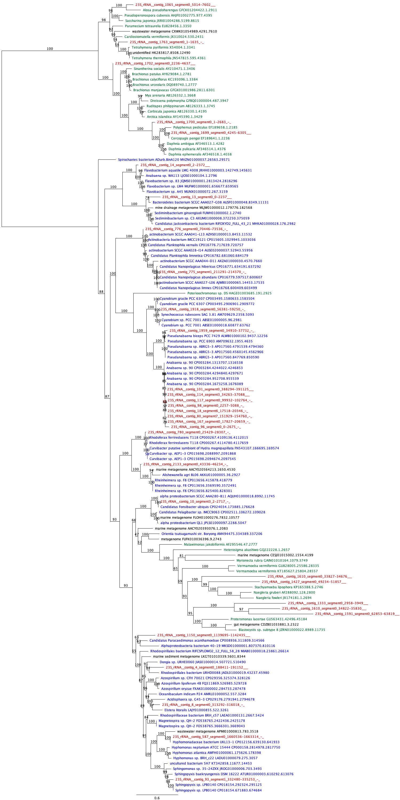

# Taughannock State Park Algal Bloom Nanopore Metagenomics

## Draft paper:
https://docs.google.com/document/d/1fhJvkneJ1Sq6AG-8kO-c0mkeYF0cZUZjH2dXriRvhD8/edit?usp=sharing


## Data location on server:
**Raw Reads:**  
/home/ps997/cyano-bloom/taughannock_HAB_all.fastq  
**Polished assembly:**  
/home/ps997/cyanobloom/taughannock_HAB_all_porechop_flye_meta_2.7/assembly.racon-iter5.medaka-consensus.fasta  
**Annotations:**  
/home/ps997/cyanobloom/taughannock_HAB_all_porechop_flye_meta_2.7/annotations/


## Outline:
1. Trim reads with PoreChop
2. Assemble trimmed reads with Flye v. 2.7 metagenomic mode
3. Polish assembly with several iterations of racon followed by Medaka
4. Assign taxonomy to contigs using Centrifuge, Kraken2, Kaiju, BLASTn, and BLASTx
5. Assign taxonomy to reads with programs that can handle it (i.e. not BLAST)
6. Cross-compare taxonomic annotations between programs

------------------

### 1. Trim reads


```bash
cd /home/ps997/cyanobloom
porechop -i taughannock_HAB_all.fastq -o taughannock_HAB_all_porechop.fastq -v 3 > porechop.out
```

### Trimming Results:
```bash
grep "reads" porechop.out

Loading reads
3,742,983 reads loaded
  425,084 / 3,742,983 reads had adapters trimmed from their start (8,560,371 bp removed)
2,680,062 / 3,742,983 reads had adapters trimmed from their end (39,091,431 bp removed)
Splitting reads containing middle adapters
150 / 3,742,983 reads were split based on middle adapters
```

| filename | total_length | number | mean_length | longest | shortest | N_count | Gaps | N50 | N50n | N70 | N70n | N90 | N90n |
|----------|--------------|--------|-------------|---------|----------|---------|------|-----|------|-----|------|----|------|
| taughannock_HAB_all.fastq | 9395949756 | 3742983 | 2510.28 | 110215 | 1 | 0 | 0 | 3645 | 630162 | 2140 | 1315530 | 1212 | 2468748 |
| taughannock_HAB_all_porechop.fastq | 9348234939 | 3743030 | 2497.50 | 110215 | 1 | 0 | 0 | 3651 | 625673 | 2138 | 1307369 | 1205 | 2458719 |

### 2. Assemble
Note: Genome size estimate comes from previous assembly


```bash
conda activate flye_2.7
flye --nano-raw taughannock_HAB_all_porechop.fastq -t 12 -g 50m --meta -o taughannock_HAB_all_porechop_flye_meta_2.7
```

### 3. Polish


```bash
# racon
cd /home/ps997/cyanobloom/taughannock_HAB_all_porechop_flye_meta_2.7/
ln -s assembly.fasta assembly.racon-iter0.fasta
for i in {1..5} ; do j=$((i-1)) ; \
minimap2 -t 12 -ax map-ont assembly.racon-iter"$j".fasta ../taughannock_HAB_all_porechop.fastq > assembly.racon-iter"$i".sam ; \
racon -t 12 ../taughannock_HAB_all_porechop.fastq assembly.racon-iter"$i".sam assembly.racon-iter"$j".fasta > assembly.racon-iter"$i".fasta 2> racon-iter"$i".out ; \
done
```


```bash
# medaka
conda activate medaka
medaka_consensus -i ../taughannock_HAB_all_porechop.fastq -d assembly.racon-iter5.fasta -t 8
```

### Polishing Results

| filename | total_length | number | mean_length | longest | shortest | N_count | Gaps | N50 | N50n | N70 | N70n | N90 | N90n |
|----------|--------------|--------|-------------|---------|----------|---------|------|-----|------|-----|------|----|------|
| assembly.racon-iter5.medaka-consensus.fasta | 48916416 | 2183 | 22407.89 | 2298548 | 80 | 0 | 0 | 90015 | 91 | 42028 | 252 | 12372 | 646 |


### 4.  Taxonomic annotation


```bash
### Commands
blastn -query assembly.racon-iter5.medaka-consensus.fasta -db ~/blastdbs/nt/nt -out blastn.results -outfmt "6 qseqid staxids bitscore" -num_threads 12 -evalue 1e-10

centrifuge -x ~/centrifugeDBs/nt/nt -k 1 -p 12 -f assembly.racon-iter5.medaka-consensus.fasta -S centrifuge.results --report-file centrifuge.report

kaiju-run -t ~/blastdbs/nodes.dmp -f ~/kaijuDBs/nr_complete/nr_complete.fmi -i assembly.racon-iter5.medaka-consensus.fasta -o kaiju.results

kraken2-run -db ~/krakenDBs/kraken_nt --threads 12 --output kraken.results assembly.racon-iter5.medaka-consensus.fasta

```
```bash
# set up directories for output
mkdir annotation ; cd annotation ; mkdir blastn ; mkdir centrifuge ; mkdir kaiju ; mkdir kraken
for i in * ; do cd $i ; mkdir split_superkingdom ; mkdir split_phylum ; mkdir split_class ; mkdir split_order ; mkdir split_family ; mkdir split_genus ; mkdir split_species ; cd .. ; done
# run parser script to get annotations at all taxonomic levels
cd blastn
for i in superkingdom phylum class order family genus species ; do taxonomicParser.py -hits ../../blastn.results -i ../../pilon-iter10.fasta -rank $i -o pilon-iter10 ; mv *"$i"_*.fasta split_"$i" ; done
cd ../centrifuge
for i in superkingdom phylum class order family genus species ; do taxonomicParser.py -hits ../../centrifuge.results -centrifuge -i ../../pilon-iter10.fasta -rank $i -o pilon-iter10 ; mv *"$i"_*.fasta split_"$i" ; done
cd ../kaiju
for i in superkingdom phylum class order family genus species ; do taxonomicParser.py -hits ../../kaiju.results -kraken -i ../../pilon-iter10.fasta -rank $i -o pilon-iter10 ; mv *"$i"_*.fasta split_"$i" ; done
cd ../kraken
for i in superkingdom phylum class order family genus species ; do taxonomicParser.py -hits ../../kraken.results -kraken -i ../../pilon-iter10.fasta -rank $i -o pilon-iter10 ; mv *"$i"_*.fasta split_"$i" ; done
```

```bash
# traverse directories with taxonomicParser.py results, get contig ID, search program name, and taxonomic annotation
RANK="superkingdom"
grep ">" assembly.racon-iter5.medaka-consensus.fasta > contig.names
while read contig ; do grep $contig */split_"$RANK"/*fasta | awk -v contig=$contig 'BEGIN { FS=":" }  { print $2"\t"$1 }' ; done < contig.names > contigs.split_"$RANK".tmp
# next line parses the file path to get contig ID, annotation tool, and taxonomic group e.g. contig1 \t blastn \t Bacteria
# need to modify search pattern for files with other directory structure or names
awk -F" |\t|\\\/" '{print $1"\t"$2"\t"$NF}' contigs.split_"$RANK".tmp > contigs.split_"$RANK".tmp2
# for species level use this awk + sed combo instead of line above
# awk -F"|\t|\\\/" '{print $1"\t"$2"\t"$NF}' contigs.split_"$RANK".tmp > contigs.split_"$RANK".tmp2
# sed -i 's/ \(contig\|scaffold\)_.\+\(    .\+     .\+\)$/\1/' contigs.split_species.tmp2 # will have to manually change tabs to tabs in shell

sed -i 's/>//' contigs.split_"$RANK".tmp2
sed -i "s/pilon-iter10_superkingdom_//" contigs.split_"$RANK".tmp2
sed -i 's/.fasta//' contigs.split_"$RANK".tmp2
mv contigs.split_"$RANK".tmp2 contigs.split_"$RANK"
rm contigs.split_"$RANK".tmp
```
```python
### python
openfile = open("contigs.split_genus","r")
contigDict = {}

for line in openfile:
	contig = line.strip("\n").split("\t")[0]
	program = line.strip("\n").split("\t")[1]
	kingdom = line.strip("\n").split("\t")[2]
	try:
		contigDict[contig].update({program:kingdom})
	except:
		contigDict[contig] = {program:kingdom}

outfile = open("classifier_genus.table", "w")
outfile.write("Contig\tBlast\tCentrifuge\tKaiju\tKraken\n")

for contig in contigDict:
	try:
		centrifuge = contigDict[contig]["centrifuge"]
	except KeyError:
		centrifuge = "NA"
	try:
		blast = contigDict[contig]["blastn"]
	except KeyError:
		blast = "NA"
	try:
		kaiju = contigDict[contig]["kaiju"]
	except KeyError:
		kaiju = "NA"
	try:
		kraken = contigDict[contig]["kraken2"]
	except KeyError:
		kraken ="NA"
	outfile.write("%s\t%s\t%s\t%s\t%s\n" %(contig, blast, centrifuge, kaiju, kraken))


```


### Annotation Results

| Classifier | # contigs unclassified | % assembly unclassified | % contigs Bacteria | % contigs Eukaryota | % contigs Archaea | % contigs Viruses |
|-------|-----|----|-------|------|----|-------|
| Blast | 473 | 3% | 90.2% | 9.5% | 0% | 0.29% |
| Centrifuge | 255 | 1.5% | 83.2% | 16.3% | 0.16% | 0.36% |
| Kaiju | 500 | 14.5% | 88.7% | 10.8% | 0.12% | 0.42% |
| Kraken | 269 | 1.5% | 81.3% | 18.2% | 0.05% | 0.42% |

| Taxonomic Rank | No. of contigs with same annotation by all 4 programs | % of assembly represented by contigs w/ perfect agreement |
|----------------|:-----------------------------------------------------:|:------------------------:
| classifier_superkingdom.table | 1255 | 80.0 |
| classifier_phylum.table | 1119 | 71.2 |
| classifier_family.table | 466 | 29.3 |
| classifier_genus.table | 342 | 20.2 |
| classifier_species.table | 77 | 9.5 |

### Graphing in R


```python
library(ggplot2)
library(viridis)
library(RColorBrewer)
{
genusDf <- as.data.frame(read.table("classifier_superkingdom.tsv", header = TRUE, row.names = 1 , sep = "\t"))
genus_blast <- as.data.frame(table(genusDf$Blast, useNA = "always"))
genus_centrifuge <- as.data.frame(table(genusDf$Centrifuge, useNA = "always"))
genus_kaiju <- as.data.frame(table(genusDf$Kaiju, useNA = "always"))
genus_kraken <- as.data.frame(table(genusDf$Kraken, useNA = "always"))
}
{
mergedTableBC <- merge(genus_blast, genus_centrifuge, by = 1, all = TRUE)
mergedTableKK <- merge(genus_kaiju, genus_kraken, by = 1, all = TRUE)
mergedTable <- merge(mergedTableBC, mergedTableKK, by = 1, all = TRUE)
mergedTable <- merge(mergedTableBC, mergedTableKK, by = 1, all = TRUE)
}

colnames(mergedTable) <- c("Genus","Blast","Centrifuge", "Kaiju","Kraken")
rowNames <- mergedTable[,1]
rowNamesList <- as.vector(rowNames)
rowNamesList[is.na(rowNamesList)] <- "Unclassified"
plotDf <- as.data.frame(mergedTable[,-1])
rownames(plotDf) <- rowNamesList
plotDf[is.na(plotDf)] <- 0

noUnclassifiedDf <- plotDf[!(row.names(plotDf)) %in% c("Unclassified", "root"), ]

blastGGdf <- as.data.frame(noUnclassifiedDf$Blast)
blastGGdf[,2] <- "Blast"
blastGGdf[,3] <- rownames(noUnclassifiedDf)
colnames(blastGGdf) <- c("count", "classifier", "genus")

centGGdf <- as.data.frame(noUnclassifiedDf$Centrifuge)
centGGdf[,2] <- "Centrifuge"
centGGdf[,3] <- rownames(noUnclassifiedDf)
colnames(centGGdf) <- c("count", "classifier", "genus")

kaijuGGdf <- as.data.frame(noUnclassifiedDf$Kaiju)
kaijuGGdf[,2] <- "Kaiju"
kaijuGGdf[,3] <- rownames(noUnclassifiedDf)
colnames(kaijuGGdf) <- c("count", "classifier", "genus")

krakenGGdf <- as.data.frame(noUnclassifiedDf$Kraken)
krakenGGdf[,2] <- "Kraken2"
krakenGGdf[,3] <- rownames(noUnclassifiedDf)
colnames(krakenGGdf) <- c("count", "classifier", "genus")

mergedGGBC <- rbind(blastGGdf, centGGdf)
mergedGGKK <- rbind(kaijuGGdf, krakenGGdf)
mergedGGdf <- rbind(mergedGGBC, mergedGGKK)

mergedGGdf_gt5 <- mergedGGdf[mergedGGdf$count >= 5, ]
absPlot <- ggplot(mergedGGdf_gt5) +
    geom_bar(aes_(y=count, x=classifier, fill=genus), position="stack", stat="identity", width = 0.5) +
    scale_fill_manual(values=rep(brewer.pal(12,"Paired"),times=40)) +
    labs(x="", y="Num. annotated contigs", fill = "")
absPlot + theme_bw()

percPlot <- ggplot(mergedGGdf_gt5) +
    geom_bar(aes_(y=count, x=classifier, fill=genus), position="fill", stat="identity") +
    scale_fill_manual(values=rep(brewer.pal(12,"Paired"),times=40)) +
    labs(x="", y="Prop. annotated contigs", fill = "")
percPlot + theme_bw()


### Histogram of unclassified contigs by length ###

contigLengths <- as.data.frame(read.table("~/Box/cyanobloom/sequences/consensus_contigLengths.tsv", sep = "\t", header = FALSE))
blastContigLengths <- as.data.frame(read.table("~/Box/cyanobloom/sequences/consensus_blastUnclassifiedcontigLengths.tsv", sep = "\t", header = FALSE))
centContigLengths <- as.data.frame(read.table("~/Box/cyanobloom/sequences/consensus_centrifugeUnclassifiedcontigLengths.tsv", sep = "\t", header = FALSE))
kaijuContigLengths <- as.data.frame(read.table("~/Box/cyanobloom/sequences/consensus_kaijuUnclassifiedcontigLengths.tsv", sep = "\t", header = FALSE))
krakenContigLengths <- as.data.frame(read.table("~/Box/cyanobloom/sequences/consensus_krakenUnclassifiedcontigLengths.tsv", sep = "\t", header = FALSE))


hist <- ggplot(contigLengths, aes(x = as.numeric(contigLengths$V2))) +
  geom_histogram(binwidth = 10000, color = "black", fill = "white", show.legend = TRUE) +
  #scale_y_log10() +
  lims(x = c(0,750000), y = c(0,425)) +
  geom_histogram(data = blastContigLengths, aes(x= as.numeric(blastContigLengths$V2)), binwidth = 10000, alpha = 1, color = "black", fill = "blue", show.legend = TRUE) +
  geom_histogram(data = kaijuContigLengths, aes(x= as.numeric(kaijuContigLengths$V2)), binwidth = 10000, alpha = 1, color = "black", fill = "green", show.legend =  TRUE) +
  geom_histogram(data = krakenContigLengths, aes(x= as.numeric(krakenContigLengths$V2)), binwidth = 10000, alpha = 1, color = "black", fill = "yellow", show.legend =  TRUE) +
  geom_histogram(data = centContigLengths, aes(x= as.numeric(centContigLengths$V2)), binwidth = 10000, alpha = 1, color = "black", fill = "red", show.legend =  TRUE) +
  scale_colour_manual(name="Unclassified Contigs", values=c("blue","red","green", "yellow"),labels=c("Blast","Centrifuge","Kaiju", "Kraken")) +
  labs(x = "Contig Length (bp)", y = "Num. of contigs")
hist + theme_bw()
hist
boxplot(contigLengths$V2, blastContigLengths$V2)
boxplot(blastContigLengths$V2)

```

### 5. rRNA extraction


```python
barrnap -outseq rRNA.fa --kingdom bac ../assembly.racon-iter5.medaka-consensus.fasta > rRNA.gff
```

barrnap identified 80 rRNA segments  
Annotated with Centrifuge and compared to whole-data results:  


### 6. Read sub-setting tests (mimic Flongle output)

Target: 2Gbp of data with similar length distribution of original data  

stats for taughannock_HAB_all_porechop.fastq  
sum = 9348234939, n = 3743030, ave = 2497.50, largest = 110215  
N50 = 3651, n = 625673  
N60 = 2765, n = 921595  
N70 = 2138, n = 1307369  
N80 = 1659, n = 1804882  
N90 = 1205, n = 2458719  
N100 = 1, n = 3743030  

2 Gbp is ~21% of entire dataset, 21% of reads is 786,036 reads  


```python
# First convert trimmed FASTQ to FASTA, extract reads
convertFastqToFasta.py taughannock_HAB_all_porechop.fastq

# Extract read names
grep ">" taughannock_HAB_all_porechop.fasta > taughannock_HAB_all_porechop.readNames.txt
awk -F" " '{print $1}' taughannock_HAB_all_porechop.readNames.txt > taughannock_HAB_all_porechop.readNames2.txt

# Check number of read names is still the same
grep -c "" taughannock_HAB_all_porechop.readNames2.txt
3743030

# Get 10 sets of 786,036 pseudo-random reads from file w/o replacement
for i in {1..10} ; do shuf -n 786036 taughannock_HAB_all_porechop.readNames2.txt > taughannock_HAB_subset"$i".txt ; done

# Create subset FASTQ files
for i in {1..10} ; do getReadsFromFastq.py taughannock_HAB_all_porechop.fastq taughannock_HAB_subset"$i".txt taughannock_HAB_subset"$i".fastq ; done

# Assemble
for i in {1..10} ; do flye --nano-raw taughannock_HAB_subset"$i".fastq -g 50m -t 12 -o taughannock_HAB_subset"$i"_flye-meta --meta ; done
```

#### Subset stats

| filename | total_length | number | mean_length | longest | shortest | N50 | N50n | N70 | N70n | N90 | N90n |
|----------|--------------|--------|-------------|---------|----------|-----|------|-----|------|-----|------|
| taughannock_HAB_all_porechop.fastq | 9348234939 | 3743030 | 2497.50 | 110215 | 1 | 3651 | 625673 | 2138 | 1307369 | 1205 | 2458719 |
| taughannock_HAB_subset10.fastq | 1962847667 | 786036 | 2497.15 | 110215 | 1 |  3656 | 131360 | 2138 | 274453 | 1205 | 516254 |
| taughannock_HAB_subset1.fastq | 1959786539 | 786036 | 2493.25 | 72721 | 1 |  3643 | 131408 | 2135 | 274580 | 1203 | 516216 |
| taughannock_HAB_subset2.fastq | 1965166573 | 786036 | 2500.10 | 110215 | 1 |  3662 | 131253 | 2139 | 274342 | 1206 | 516224 |
| taughannock_HAB_subset3.fastq | 1961303538 | 786036 | 2495.18 | 110215 | 1 | 3647 | 131551 | 2137 | 274721 | 1205 | 516248 |
| taughannock_HAB_subset4.fastq | 1960259504 | 786036 | 2493.85 | 110215 | 1 | 3643 | 131594 | 2136 | 274711 | 1205 | 516343 |
| taughannock_HAB_subset5.fastq | 1961064514 | 786036 | 2494.88 | 110215 | 1 | 3639 | 131572 | 2135 | 274769 | 1204 | 516542 |
| taughannock_HAB_subset6.fastq | 1961001758 | 786036 | 2494.80 | 65417 | 1 | 3643 | 131629 | 2134 | 274928 | 1205 | 516765 |
| taughannock_HAB_subset7.fastq | 1961693062 | 786036 | 2495.68 | 79317 | 1 | 3646 | 131337 | 2135 | 274561 | 1205 | 516468 |
| taughannock_HAB_subset8.fastq | 1965258903 | 786036 | 2500.21 | 82641 | 1 | 3658 | 131449 | 2139 | 274593 | 1206 | 516405 |
| taughannock_HAB_subset9.fastq | 1962476257 | 786036 | 2496.67 | 79317 | 1 | 3650 | 131647 | 2137 | 274841 | 1206 | 516590 |

#### Subset assemblies


| filename | total_length | number | mean_length | longest | shortest | N_count | Gaps | N50 | N50n | N70 | N70n | N90 | N90n |
|----------|--------------|--------|-------------|---------|----------|---------|------|-----|------|-----|------|----|------|
| taughannock_HAB_subset10_flye-meta/assembly.fasta | 18437158 | 817 | 22566.90 | 1738528 | 493 | 300 | 3 | 77933 | 49 | 43337 | 113 | 14328 | 249 |
| taughannock_HAB_subset1_flye-meta/assembly.fasta | 17344702 | 824 | 21049.40 | 1175422 | 503 | 600 | 6 | 72499 | 50 | 43463 | 113 | 11034 | 249 |
| taughannock_HAB_subset2_flye-meta/assembly.fasta | 17160302 | 802 | 21396.89 | 849869 | 434 | 300 | 3 | 68460 | 53 | 41036 | 118 | 14007 | 251 |
| taughannock_HAB_subset3_flye-meta/assembly.fasta | 18274250 | 840 | 21755.06 | 599348 | 500 | 300 | 3 | 77036 | 54 | 41372 | 119 | 12562 | 258 |
| taughannock_HAB_subset4_flye-meta/assembly.fasta | 17506307 | 808 | 21666.22 | 2533831 | 84 | 300 | 3 | 72978 | 46 | 40556 | 110 | 11757 | 247 |
| taughannock_HAB_subset5_flye-meta/assembly.fasta | 17621591 | 840 | 20978.08 | 760926 | 497 | 0 | 0 | 77102 | 55 | 41398 | 119 | 11631 | 261 |
| taughannock_HAB_subset6_flye-meta/assembly.fasta | 17495074 | 841 | 20802.70 | 1529522 | 430 | 200 | 2 | 73529 | 56 | 42082 | 121 | 11230 | 255 |
| taughannock_HAB_subset7_flye-meta/assembly.fasta | 17944380 | 887 | 20230.42 | 650153 | 114 | 300 | 3 | 69465 | 64 | 40576 | 134 | 11080 | 281 |
| taughannock_HAB_subset8_flye-meta/assembly.fasta | 18374279 | 803 | 22882.04 | 1659072 | 506 | 100 | 1 | 74559 | 53 | 42348 | 118 | 15446 | 251 |
| taughannock_HAB_subset9_flye-meta/assembly.fasta | 18207798 | 871 | 20904.48 | 1709113 | 505 | 0 | 0 | 60489 | 68 | 38461 | 144 | 13143 | 287 |


#### Subset comparisons
Total assembly vs. subsets annotated by BLASTn. Violin plots are distribution of subset results, red dots represent assembly of all data. For phylum, order, family, and genus only taxa representing > 1% of contigs are shown.


### 7. Map classifications to isolated subassemblies in assembly graph

Victor identified contigs using Bandage:
1.	edge_100, edge_1011, edge_1012, edge_102, edge_1024, edge_1025, edge_1026, edge_1027, edge_1028, edge_1029, edge_103, edge_1030, edge_1031, edge_104, edge_1042, edge_105, edge_106, edge_107, edge_1079, edge_108, edge_1080, edge_1081, edge_1082, edge_110, edge_111, edge_1110, edge_112, edge_1125, edge_113, edge_1133, edge_114, edge_1140, edge_115, edge_116, edge_117, edge_118, edge_1182, edge_120, edge_121, edge_1215, edge_122, edge_123, edge_124, edge_1241, edge_1243, edge_125, edge_126, edge_127, edge_1278, edge_1279, edge_128, edge_1280, edge_1281, edge_129, edge_130, edge_1309, edge_131, edge_1310, edge_1311, edge_132, edge_1327, edge_133, edge_134, edge_135, edge_1352, edge_1353, edge_136, edge_137, edge_138, edge_139, edge_141, edge_1419, edge_142, edge_143, edge_144, edge_145, edge_146, edge_147, edge_148, edge_1481, edge_1482, edge_1483, edge_1484, edge_1489, edge_149, edge_1490, edge_1491, edge_150, edge_151, edge_152, edge_1520, edge_1523, edge_153, edge_154, edge_155, edge_1557, edge_156, edge_1562, edge_1572, edge_1573, edge_1574, edge_1575, edge_1576, edge_1577, edge_158, edge_1584, edge_1585, edge_1586, edge_159, edge_16, edge_160, edge_1604, edge_1605, edge_161, edge_162, edge_163, edge_1630, edge_1631, edge_1633, edge_1634, edge_1646, edge_1647, edge_165, edge_1658, edge_1659, edge_166, edge_1660, edge_167, edge_168, edge_169, edge_170, edge_171, edge_172, edge_179, edge_1791, edge_1792, edge_1793, edge_18, edge_188, edge_189, edge_19, edge_190, edge_191, edge_194, edge_200, edge_203, edge_204, edge_205, edge_206, edge_207, edge_2101, edge_2103, edge_2108, edge_2109, edge_211, edge_2111, edge_2112, edge_2113, edge_2114, edge_2115, edge_2116, edge_2117, edge_2119, edge_212, edge_2120, edge_2121, edge_213, edge_2130, edge_214, edge_2145, edge_2151, edge_217, edge_2177, edge_2181, edge_2183, edge_221, edge_222, edge_224, edge_225, edge_226, edge_227, edge_230, edge_237, edge_24, edge_242, edge_25, edge_250, edge_251, edge_252, edge_253, edge_254, edge_255, edge_256, edge_257, edge_258, edge_259, edge_26, edge_260, edge_261, edge_262, edge_263, edge_264, edge_265, edge_266, edge_267, edge_268, edge_269, edge_27, edge_270, edge_271, edge_272, edge_273, edge_274, edge_275, edge_276, edge_277, edge_278, edge_279, edge_28, edge_280, edge_281, edge_282, edge_283, edge_285, edge_286, edge_287, edge_288, edge_289, edge_29, edge_290, edge_291, edge_292, edge_293, edge_294, edge_295, edge_296, edge_297, edge_298, edge_299, edge_30, edge_300, edge_301, edge_302, edge_303, edge_304, edge_305, edge_306, edge_309, edge_31, edge_310, edge_311, edge_312, edge_313, edge_315, edge_316, edge_317, edge_318, edge_32, edge_320, edge_321, edge_322, edge_324, edge_325, edge_326, edge_327, edge_33, edge_330, edge_331, edge_332, edge_333, edge_334, edge_335, edge_336, edge_338, edge_34, edge_340, edge_342, edge_343, edge_344, edge_345, edge_346, edge_347, edge_348, edge_35, edge_350, edge_353, edge_354, edge_355, edge_357, edge_36, edge_368, edge_37, edge_374, edge_376, edge_38, edge_380, edge_381, edge_382, edge_383, edge_384, edge_385, edge_386, edge_387, edge_388, edge_389, edge_39, edge_390, edge_391, edge_392, edge_393, edge_394, edge_395, edge_396, edge_397, edge_399, edge_40, edge_400, edge_401, edge_402, edge_403, edge_404, edge_405, edge_406, edge_407, edge_408, edge_409, edge_41, edge_410, edge_411, edge_412, edge_413, edge_414, edge_415, edge_416, edge_417, edge_418, edge_419, edge_42, edge_420, edge_421, edge_422, edge_423, edge_424, edge_425, edge_426, edge_427, edge_428, edge_429, edge_43, edge_430, edge_431, edge_432, edge_433, edge_434, edge_435, edge_436, edge_437, edge_438, edge_439, edge_44, edge_441, edge_442, edge_443, edge_444, edge_445, edge_446, edge_447, edge_448, edge_449, edge_45, edge_450, edge_451, edge_452, edge_453, edge_454, edge_455, edge_456, edge_457, edge_458, edge_459, edge_46, edge_460, edge_461, edge_462, edge_463, edge_464, edge_465, edge_466, edge_467, edge_468, edge_469, edge_47, edge_470, edge_471, edge_472, edge_474, edge_475, edge_476, edge_477, edge_478, edge_479, edge_48, edge_480, edge_481, edge_482, edge_483, edge_487, edge_488, edge_49, edge_491, edge_494, edge_495, edge_497, edge_50, edge_506, edge_507, edge_510, edge_511, edge_512, edge_513, edge_514, edge_516, edge_52, edge_524, edge_525, edge_526, edge_527, edge_528, edge_53, edge_533, edge_536, edge_54, edge_547, edge_548, edge_549, edge_55, edge_56, edge_567, edge_568, edge_569, edge_57, edge_570, edge_572, edge_573, edge_574, edge_575, edge_576, edge_577, edge_578, edge_58, edge_59, edge_594, edge_60, edge_61, edge_616, edge_62, edge_63, edge_639, edge_64, edge_640, edge_641, edge_65, edge_651, edge_652, edge_653, edge_655, edge_66, edge_67, edge_68, edge_69, edge_699, edge_701, edge_71, edge_72, edge_74, edge_75, edge_76, edge_760, edge_761, edge_765, edge_768, edge_77, edge_78, edge_79, edge_80, edge_81, edge_82, edge_83, edge_84, edge_858, edge_86, edge_864, edge_865, edge_867, edge_868, edge_89, edge_91, edge_915, edge_916, edge_917, edge_918, edge_919, edge_92, edge_920, edge_921, edge_922, edge_923, edge_924, edge_925, edge_926, edge_927, edge_928, edge_929, edge_93, edge_931, edge_932, edge_934, edge_939, edge_94, edge_942, edge_95, edge_96, edge_97, edge_978, edge_98, edge_99 (526 total)
2.	edge_10, edge_1006, edge_1007, edge_1092, edge_1094, edge_1191, edge_1193, edge_13, edge_1363, edge_1364, edge_1365, edge_14, edge_1450, edge_1454, edge_1455, edge_1930, edge_1931, edge_2, edge_201, edge_2100, edge_2125, edge_2167, edge_4, edge_551, edge_552, edge_553, edge_558, edge_559, edge_560, edge_582, edge_623, edge_660, edge_9, edge_998  (34 total)
3.	edge_587
4.	edge_1141, edge_1142, edge_1143, edge_1144, edge_1145, edge_1146, edge_1147, edge_1148, edge_1149, edge_1150, edge_1151, edge_1152, edge_1153, edge_1154, edge_1156, edge_1157, edge_1158, edge_1159, edge_2153, edge_2154 (20 total)
5.	edge_1589, edge_2128, edge_624, edge_625, edge_626, edge_627, edge_628, edge_629, edge_630, edge_811 (10 total)
6.	edge_1802, edge_683 (2 total)
7.	edge_183, edge_2105, edge_2106 (3 total)
8.	edge_2142, edge_2143, edge_775, edge_908, edge_909, edge_910, edge_911, edge_912, edge_913 (9 total)
9.	edge_101
10.	edge_8
11.	edge_1017, edge_1018, edge_1019, edge_1020 (4 total)
12.	edge_875
13.	edge_1330, edge_2166, edge_606 (3 total)
14.	edge_2133, edge_2139, edge_2140 (3 total)
15.	edge_1112
16.	edge_1468
17.	edge_2180
18.	edge_1339
19.	edge_2162 (circular)
20.	edge_1544
21.	edge_1716
22.	edge_218
23.	edge_1378
24.	edge_1202, edge_1203, edge_1204, edge_1205, edge_1208 (5 total)
25.	edge_586
26.	edge_1811
27.	edge_645
28.	edge_2021
29.	edge_1164
30.	edge_1779
31.	edge_834
32.	edge_1344
33.	edge_1606
34.	edge_1354
35.	edge_2172
36.	edge_209
37.	edge_1546
38.	edge_776
39.	edge_1381
40.	edge_1895
41.	edge_1472
42.	edge_1864
43.	edge_806
44.	edge_565 (circular)
45.	edge_87 (circular)
46.	edge_1869, edge_1870, edge_1871 (3 total)
47.	edge_2013
48.	edge_1776
49.	edge_2126
50.	edge_2193
51.	edge_1155 (circular)
52.	edge_1608
53.	edge_1603
54.	 edge_181
55.	edge_1853
56.	edge_88 (circular)
57.	edge_1104, edge_1105, edge_1107 (3 total)
58.	edge_504 (circular)
59.	edge_323 (circular)
60.	edge_952
61.	edge_1621
62.	edge_840
63.	edge_973
64.	edge_1737
65.	edge_1238
66.	edge_1910
67.	edge_232, edge_233, edge_234, edge_235, edge_236, edge_682 (6 total)
68.	edge_696
69.	edge_1918
70.	edge_490
71.	edge_522 (circular)
72.	edge_664
73.	edge_1769
74.	edge_1545
75.	edge_838, edge_841, edge_842, edge_847 (4 total)
76.	edge_1345
77.	edge_2124


I extracted genus-level classifications from annotation results:


```python
contigList = []

with open("assembly_subgenome1_contiglist.txt", "r") as contigFile:
    for line in contigFile:
        contigList.append(line.strip("\n"))

with open("classifier_family.table", "r") as classifierFile, open("assembly_subgenome1_classifier_family.tsv", "w") as outfile:
    linecount = 0
    for line in classifierFile:
        linecount += 1
        if linecount == 1:
            outfile.write(line)
        splitline = line.strip("\n").split("\t")
        contigName = "_".join(splitline[0].split("_")[0:2])
        if contigName in contigList:
            outfile.write(line)
```

Using Victor's list of contigs, extract sequences from assembly.
```
getScaffoldsFromFasta.py assembly.racon-iter5.fasta assembly_subgenome1_contiglist.txt

minimap2 -ax map-ont -t 12 assembly_subgenome1_contiglist.txt.fasta ../taughannock_HAB_all_porechop.fastq.gz assembly_subgenome1_contiglist.txt.fasta.sam

samtools view -h -F 4 assembly_subgenome1_contiglist.txt.fasta.sam > assembly_subgenome1_contiglist.txt.fasta.sam.mapped.sam

samtools sort assembly_subgenome1_contiglist.txt.fasta.sam.mapped.sam > assembly_subgenome1_contiglist.txt.fasta.sam.mapped.sam.sorted.sam

picard SamToFastq I=assembly_subgenome1_contiglist.txt.fasta.sam.mapped.sam.sorted.sam FASTQ=assembly_subgenome1_contiglist.txt.fasta.sam.mapped.sam.sorted.sam.fastq

flye --nano-raw assembly_subgenome1_contiglist.txt.fasta.sam.mapped.sam.sorted.sam.fastq --threads 12 --out-dir assembly_subgenome1_flye --genome-size 10m
```

** This doesn't help either!!!**

### 8. Gene prediction and functional annotation

Run MetaGeneMark on medaka polishing contigs here http://exon.gatech.edu/meta_gmhmmp.cgi. Also run on all subsets.

| filename | total_length | number | mean_length | longest | shortest | N_count | Gaps | N50 | N50n | N70 | N70n | N90 | N90n |
|----------|--------------|--------|-------------|---------|----------|---------|------|-----|------|-----|------|-----|------|
| taughannock_HAB_all_porechop | 12289566 | 66490 | 184.83 | 4721 | 18 | 434440 | 415726 | 252 | 14920 | 166 | 26956 | 90 | 46758 |
| taughannock_HAB_subset1 | 4158815 | 22234 | 187.05 | 2717 | 18 | 170921 | 162615 | 260 | 4923 | 167 | 8896 | 91 | 15556 |
| taughannock_HAB_subset2 | 4147767 | 22429 | 184.93 | 3817 | 18 | 166000 | 158062 | 257 | 4972 | 165 | 8988 | 89 | 15732 |
| taughannock_HAB_subset3 | 4372196 | 23827 | 183.50 | 2941 | 18 | 175815 | 167478 | 254 | 5295 | 164 | 9594 | 89 | 16715 |
| taughannock_HAB_subset4 | 4204759 | 22534 | 186.60 | 3640 | 18 | 171250 | 162977 | 258 | 5002 | 167 | 9049 | 90 | 15822 |
| taughannock_HAB_subset5 | 4251093 | 23034 | 184.56 | 3817 | 18 | 170895 | 162677 | 255 | 5105 | 164 | 9238 | 89 | 16160 |
| taughannock_HAB_subset6 | 4233123 | 22922 | 184.68 | 3752 | 18 | 170188 | 161968 | 255 | 5084 | 164 | 9210 | 90 | 16103 |
| taughannock_HAB_subset7 | 4279453 | 23609 | 181.26 | 2214 | 18 | 172744 | 164487 | 250 | 5260 | 161 | 9522 | 88 | 16600 |
| taughannock_HAB_subset8 | 4421640 | 24095 | 183.51 | 3850 | 18 | 177176 | 168794 | 256 | 5336 | 164 | 9662 | 89 | 16902 |
| taughannock_HAB_subset9 | 4336918 | 23930 | 181.23 | 3286 | 18 | 174203 | 165857 | 253 | 5257 | 161 | 9569 | 87 | 16797 |
| taughannock_HAB_subset10 | 4432135 | 24061 | 184.20 | 3752 | 18 | 179131 | 170581 | 255 | 5316 | 164 | 9642 | 89 | 16893 |


Get conversion table files for contigs, genes, COG groups, and taxonomy
```
cd /home/ps997/cyanobloom/taughannock_HAB_all_porechop_flye_meta_2.7/eggnog_annotation
cut -f 1,21 gmhmmp.emapper.annotations > cog_annotations.tsv
grep ">" ../gmhmmp.out.faa > gmhmmp.out.names
cut -f 1,2 ../annotations/classifier_genus.table > contigs_blastn_genus.tsv


```python
dict = {}
with open("gmhmmp.out.names", "r") as infile:
    for line in infile:
            splitline = line.strip(">\n").split("\t")
            geneName = splitline[0]
            contigName = splitline[1].strip(">").split(" ")[0]
            dict[geneName] = { "contigName" : contigName }

with open("contigs_blastn_genus.tsv", "r") as infile:
    for line in infile:
            splitline = line.strip(">\n").split("\t")
            contigName = splitline[0]
            genusName = splitline[1]
            for geneName in dict:
                try:
                    if dict[geneName]["contigName"] == contigName:
                        dict[geneName].update({ "genusName" : genusName })
                except KeyError:
                    pass

with open("cog_annotations.tsv", "r") as infile:
    for line in infile:
            if line.startswith("#"):
                pass
            else:
                splitline = line.strip("\n").split("\t")
                geneName = splitline[0]
                cog = splitline[1]
                dict[geneName].update({ "cog" : list(cog)})

with open("cog_table.tsv", "w") as outfile:
    outfile.write("GeneName\tContig\tTaxon\tCOG\n")
    for geneName in dict:
        contigName = dict[geneName]["contigName"]
        try:
            genusName = dict[geneName]["genusName"]
        except KeyError:
            genusName = " "
        try:
            cog = dict[geneName]["cog"]
        except KeyError:
            cog = []
        for item in cog:
            outfile.write("%s\t%s\t%s\t%s\n" %(geneName, contigName, genusName, item))

```

#### Functional annotation results
**Histogram of all gene COG annotations**


** Presence/absence of COG annotations by genus**


---------------------------------------          

### 9. 16S and 23S phylogenies

Download references from SILVA
```
wget https://ftp.arb-silva.de/release_138_1/Exports/SILVA_138.1_LSURef_NR99_tax_silva.fasta.gz
wget https://ftp.arb-silva.de/release_138_1/Exports/SILVA_138.1_SSURef_NR99_tax_silva.fasta.gz
```

Create blastdbs for each, run blastn using barrnap output.
```
makeblastdb -in SILVA_138.1_LSURef_NR99_tax_silva.fasta -dbtype nucl -parse_seqids -out SILVA_138.1_LSURef_NR99_tax_silva
makeblastdb -in SILVA_138.1_SSURef_NR99_tax_silva.fasta -dbtype nucl -parse_seqids -out SILVA_138.1_SSURef_NR99_tax_silva

blastn -query rRNA-16S.fa -evalue 1e-10 -db ~/blastdbs/SILVA_138.1_SSURef_NR99_tax_silva -outfmt 6 -out rRNA-16S.blastn.SILVA
blastn -query rRNA-23S.fa -evalue 1e-10 -db ~/blastdbs/SILVA_138.1_LSURef_NR99_tax_silva -outfmt 6 -out rRNA-23S.blastn.SILVA

sort -k1,1 -k12,12nr rRNA-16S.blastn.SILVA > rRNA-16S.blastn.SILVA.sorted
cut -f 1 rRNA-16S.blastn.SILVA | sort | uniq > rRNA-16S.blastn.SILVA.querynames
while read line ; do grep -m 5 "$line" rRNA-16S.blastn.SILVA.sorted ; done < rRNA-16S.blastn.SILVA.querynames > rRNA-16S.blastn.SILVA.topresults
cut -f 2 rRNA-16S.blastn.SILVA.topresults | sort | uniq > rRNA-16S.blastn.SILVA.tophits
getScaffoldsFromFasta.py ~/blastdbs/SILVA_138.1_SSURef_NR99_tax_silva.fasta rRNA-16S.blastn.SILVA.tophits
cat rRNA-16S.fa rRNA-16S.blastn.SILVA.tophits.fasta > rRNA-16S_samples_and_refs.fasta
mafft --auto --adjustdirection rRNA-16S_samples_and_refs.fasta > rRNA-16S_samples_and_refs.MAFFT.fasta

sort -k1,1 -k12,12nr rRNA-23S.blastn.SILVA > rRNA-23S.blastn.SILVA.sorted
cut -f 1 rRNA-23S.blastn.SILVA | sort | uniq > rRNA-23S.blastn.SILVA.querynames
while read line ; do grep -m 5 "$line" rRNA-23S.blastn.SILVA.sorted ; done < rRNA-23S.blastn.SILVA.querynames > rRNA-23S.blastn.SILVA.topresults
cut -f 2 rRNA-23S.blastn.SILVA.topresults | sort | uniq > rRNA-23S.blastn.SILVA.tophits
getScaffoldsFromFasta.py ~/blastdbs/SILVA_138.1_LSURef_NR99_tax_silva.fasta rRNA-23S.blastn.SILVA.tophits
cat rRNA-23S.fa rRNA-23S.blastn.SILVA.tophits.fasta > rRNA-23S_samples_and_refs.fasta
mafft --auto --adjustdirection rRNA-23S_samples_and_refs.fasta > rRNA-23S_samples_and_refs.MAFFT.fasta

iqtree -m MFP -nt AUTO -s rRNA-16S_samples_and_refs.MAFFT.fasta -bb 5000 -alrt 5000
iqtree -m MFP -nt AUTO -s rRNA-23S_samples_and_refs.MAFFT.fasta -bb 5000 -alrt 5000

grep ">" rRNA-16S.blastn.SILVA.tophits.fasta | awk -F";" '{print $1"\t"$NF}' > rRNA-16S.blastn.SILVA.tophits.renametable
sed -i 's/>//' rRNA-16S.blastn.SILVA.tophits.renametable
sed -i 's/ Bacteria//' rRNA-16S.blastn.SILVA.tophits.renametable
sed -i 's/ Eukaryota//' rRNA-16S.blastn.SILVA.tophits.renametable
sed  -i 's/(.*)//' rRNA-16S.blastn.SILVA.tophits.renametable

grep ">" rRNA-23S.blastn.SILVA.tophits.fasta | awk -F";" '{print $1"\t"$NF}' > rRNA-23S.blastn.SILVA.tophits.renametable
sed -i 's/>//' rRNA-23S.blastn.SILVA.tophits.renametable
sed -i 's/ Bacteria//' rRNA-23S.blastn.SILVA.tophits.renametable
sed -i 's/ Eukaryota//' rRNA-23S.blastn.SILVA.tophits.renametable
sed  -i 's/(.*)//' rRNA-23S.blastn.SILVA.tophits.renametable
```


```python
renameTable = {}
with open("rRNA-16S.blastn.SILVA.tophits.renametable","r") as infile:
    for line in infile:
        splitline = line.strip("\n").split("\t")
        renameTable.update({splitline[0] : splitline[1]})
with open("rRNA-16S_samples_and_refs.MAFFT.fasta.contree","r") as infile:
    for line in infile:
        line = line
for key in renameTable:
    newName = "%s %s" %(renameTable[key],key)
    line = line.replace(key, newName)
with open("rRNA-16S_samples_and_refs.MAFFT.fasta.contree.renamed", "w") as outfile:
    outfile.write("%s\n" % line)


renameTable = {}
with open("rRNA-23S.blastn.SILVA.tophits.renametable","r") as infile:
    for line in infile:
        splitline = line.strip("\n").split("\t")
        renameTable.update({splitline[0] : splitline[1]})
with open("rRNA-23S_samples_and_refs.MAFFT.fasta.contree","r") as infile:
    for line in infile:
        line = line
for key in renameTable:
    newName = "%s %s" %(renameTable[key],key)
    line = line.replace(key, newName)
with open("rRNA-23S_samples_and_refs.MAFFT.fasta.contree.renamed", "w") as outfile:
    outfile.write("%s\n" % line)
```

#### Trees

**Green = Eukaryote**  
**Blue = Bacteria**  
**Red = our metagenome**  





# Illumina Sequencing
## Shotgun Metagenome
Found samples in freezer, extracted DNA from 2 tube using EZ-DNA. Library construction and 2Gb sequencing by MiGS in January 2021. Data received 29 Jan. 2021. Stored on server at `/home/ps997/cyanobloom/illumina/Taughannock_HAB_S232_R*_001.fastq.gz`.
```
# Quality Filtering
fastp --in1 Taughannock_HAB_S232_R1_001.fastq.gz --in2 Taughannock_HAB_S232_R2_001.fastq.gz --out1 Taughannock_HAB_S232_R1_001.fastp.fastq.gz --out2 Taughannock_HAB_S232_R2_001.fastp.fastq.gz --detect_adapter_for_pe --correction -p -5 -3 -w 12
```
Reads Pre-filter: 28.52 M  
Reads Post-filter: 27.77 M  
Bases Pre-filter: 3.62 G  
Bases Post-filter: 3.51 G  
Full report: [Taughannock_HAB_fastp_report.html](/Taughannock_HAB_fastp_report.html)  

### Contig Coverage
Comparing read depth (coverage) of polished assembly contigs, ONT vs. Illumina, normalized to 1-100 scale.  
  
Linear models (blue lines) significantly positive at p<0.001 with slopes 1.007 to 1.174, similar to x=y (red lines), but spread fairly high (r^2 = 0.3-0.5).  
Only ~75% of Illumina reads mapping to assembly!

### Illumina Assembly
Metagenomic assembly by SPAdes:  
sum = 183936875, n = 489770, ave = 375.56, largest = 220353  
N50 = 353, n = 110888  
N60 = 284, n = 169368  
N70 = 256, n = 238193  
N80 = 237, n = 312982  
N90 = 220, n = 393602  
N100 = 56, n = 489770  
N_count = 49530  
Gaps = 822  

### Nanopore Assembly Polishing
Ran 10 iterations of Pilon with mapped illumina data as --frags and mapped nanopore data as --nanopore.


Tabulate number of changes made to each contig
```bash
awk -F" |:" '{print $1}' pilon-iter1.changes > pilon-iter1.changes.contigs
pyTable.py pilon-iter1.changes.contigs > pilon-iter1.changes.contigs.counts
```

Combine mean read coverage with tabulated changes per contig:
```python
with open("pilon-iter8.illuminaVSont.meanDepth.tsv","r") as infile:
	dict = {}
	for line in infile:
		splitline = line.strip("\n").split("\t")
		dict.update({splitline[0] : [splitline[1], splitline[2]]})

with open("pilon-iter1.changes.contigs.counts","r") as infile2:
	for line in infile2:
		splitline = line.strip("\n").split("\t")
		dict[splitline[0]].append(splitline[1])

with open("pilon-iter8.illuminaVSont.meanDepth.changeCounts.tsv","w") as outfile:
	for key in dict:
		try:
			outfile.write(key + "\t" + dict[key][0] + "\t" + dict[key][1] + "\t" + dict[key][2] + "\n")
		except:
			outfile.write(key + "\t" + dict[key][0] + "\t" + dict[key][1] + "\t0\n")
```
Plot in R
```
meanDepthCounts <- read.delim("~/Desktop/HAB/Illumina_polished_asm/pilon-iter8.illuminaVSont.meanDepth.changeCounts.tsv", sep = "\t", header = FALSE)
plot(meanDepthCounts$V4, meanDepthCounts$V3, pch = 20, cex = 0.5)
plot(meanDepthCounts$V4, meanDepthCounts$V3, pch = 20, cex = 0.5, xlim = c(0,50))
```

  

Most contigs with high number of changes (>500) have lower nanopore read coverage (<50). But doesn't account for wide range in contig length -- need to calculate changes/bp. Also coverage is highly variable across contigs, so need to examine coverage at location of changes.  

Parse changes file, get contig and position of each change, rum samtools depth to get nanopore depth at that position.
```python
import subprocess
with open("pilon-iter1.changes", "r") as infile:
  outfile = open("pilon-iter1.depthByChangeSite.txt", "w")
  for line in infile:
    splitline = line.strip("\n").split(" ")
    splitline2 = splitline[0].split(":")
    contig = splitline2[0]
    range = splitline2[1].split("-")
    if len(range) == 1:
      range.append(range[0])
    cmd = ["samtools","depth", "-a", "-r", "%s:%s" %(contig, "-".join(range)), "consensus.readsmapped.bam"]
    proc = subprocess.run(cmd, capture_output=True, text=True)
    outfile.write(proc.stdout)
outfile.close()
    #results = proc.stdout.split("\n")
    #for returnLine in results:
    #  splitReturnLine = returnLine.strip("\n").split("\t")
    #  try:
    #    print(splitReturnLine[2])
    #  except:
    #    continue
```
Get nanopore read depths for all sites in metagenome, then cut columns from file and file with changed sites.
```bash
samtools depth -a -a consensus.readsmapped.bam > pilon-iter1.depthAllSites.tx
cut -f 3 pilon-iter1.depthAllSites.txt > pilon-iter1.depthAllSites.depths.txt
cut -f 3 pilon-iter1.depthByChangeSite.txt > pilon-iter1.depthByChangeSite.depths.txt
```
Import into R
```
depthAllSites <- read.delim("~/Desktop/HAB/Illumina_polished_asm/pilon-iter1.depthAllSites.depths.txt", header = FALSE)
depthChangedSites <- read.delim("~/Desktop/HAB/Illumina_polished_asm/pilon-iter1.depthByChangeSite.depths.txt", header = FALSE)

t.test(depthAllSites$V1, depthChangedSites$V1, alternative = "two.sided", paired = FALSE, conf.level = 0.99)
>	Welch Two Sample t-test
>
> data:  depthAllSites$V1 and depthChangedSites$V1
> t = -167.01, df = 262845, p-value < 2.2e-16
> alternative hypothesis: true difference in means is not equal to 0
> 99 percent confidence interval:
>  -106.7317 -103.4894
> sample estimates:
> mean of x mean of y
> 122.5744  227.6849

hist(log(depthAllSites$V1), breaks = 100, xlab = "ln(depth) of all sites", main = "")
hist(log(depthChangedSites$V1), xlim = c(0,8), breaks = 100, xlab = "ln(depth) of changed sites", main = "")
```
  

T-test results strongly suggest (p < 2.2e-16) that sites changed during Illlumina polishing had higher nanopore coverage (mean 227.7) than all sites in the metagenome (mean 122.6). Both distributions appear to be bimodal, violating t-test assumptions, but relative heights of peaks suggest the 'high coverage' peak of the changed sites is taller relative to its 'low coverage' peak, compared to the peaks for all sites. May point to multiple strains of Dolichospermum as suspected from assembly graph -- need to investigate which are high-coverage/high-change contigs.
```bash
# get changed sites with coverage > 100 (ln(4.6))
awk -F"\t" '{ if ($3 > 100) print $0}' pilon-iter1.depthByChangeSite.txt > pilon-iter1.depthByChangeSite.gt100.txt
cut -f 1 pilon-iter1.depthByChangeSite.gt100.txt > pilon-iter1.depthByChangeSite.gt100.contigs.txt
# summarize # changed sites per contig
pyTable.py pilon-iter1.depthByChangeSite.gt100.contigs.txt > pilon-iter1.depthByChangeSite.gt100.contigSummary.txt
# In R, determined 11 of the high-coverage contigs contain ~50% of all changes
# Found all are Anabaena/Dolichospermum contigs
grep -f pilon-iter1.depthByChangeSite.gt100.n50.contigs.txt annotation/classifier_genus.table
> contig_101_segment0	Dolichospermum	Anabaena	Anabaena	Dolichospermum
> contig_120_segment0	Dolichospermum	Anabaena	Anabaena	Dolichospermum
> contig_122_segment1	Dolichospermum	Anabaena	Anabaena	Anabaena
> contig_126_segment0	Dolichospermum	Anabaena	Anabaena	Dolichospermum
> contig_300_segment0	Anabaena	Anabaena	Anabaena	Dolichospermum
> contig_72_segment0	Dolichospermum	Anabaena	Anabaena	Dolichospermum
> contig_80_segment7	Dolichospermum	Anabaena	Anabaena	Dolichospermum
> contig_81_segment0	Dolichospermum	Anabaena	Anabaena	Dolichospermum
> contig_83_segment0	Dolichospermum	Anabaena	Anabaena	Dolichospermum
> contig_89_segment2	Planktophila	Anabaena	root	Anabaena
> contig_93_segment1	Dolichospermum	Anabaena	Anabaena	Anabaena
```
That all the high-coverage contigs with most of the changes could still be affect of those contigs being longer. Next, calculate changes/bp.
```bash
# Extract contig lengths from samtools indexed fasta
cut -f 1,2 consensus.fasta.fai > pilon-iter1.contigLengths.txt
# Use previously calculated number of changes per contig
pilon-iter1.changes.contigs.counts

```
Merge contig length list and changed site by contig list
```python
dict = {}
with open("pilon-iter1.contigLengths.txt", "r") as lengthFile:
  for line in lengthFile:
    splitline = line.strip("\n").split("\t")
    contigName = splitline[0]
    contigLength = float(splitline[1])
    dict.update({contigName : [contigLength]})
with open("pilon-iter1.changes.contigs.counts", "r") as changeFile:
  for line in changeFile:
    splitline = line.strip("\n").split("\t")
    contigName = splitline[0]
    contigChanges = float(splitline[1])
    dict[contigName].append(contigChanges)
with open("pilon-iter1.changesByLength.txt", "w") as outfile:
  outfile.write("Contig\tLength\tChanges\tChanges_per_bp\n")
  for key in dict:
    try:
      changes = dict[key][1]
      ratio = float(dict[key][1]/dict[key][0])
    except:
      changes = 0
      ratio = 0
    outfile.write("%s\t%d\t%d\t%f\n" %(key, dict[key][0], changes, ratio))
```
In R, test relationships between length, changes, and coverage
```
changesByLength <- read.delim("~/Desktop/HAB/Illumina_polished_asm/pilon-iter1.changesByLength.txt", sep = "\t", header = TRUE)

# linear model of changes vs. contig length
changesByLength_lm <- lm(Changes ~ Length, data = changesByLength)

# generate confidence interval of linear model
newx = seq(min(changesByLength$Length),max(changesByLength$Length),by = 1)
pred_interval <- predict(changesByLength_lm, newdata=data.frame(Length=newx), interval="prediction",level = 0.9999)
pred_lower <- lm(pred_interval[,2] ~ newx)
pred_upper <- lm(pred_interval[,3] ~ newx)

# separate dataframe into contigs in 'high-coverage' and 'low-coverage' peaks.
changesByLength_covgt100 <- changesByLength[changesByLength$Contig %in% depthChangesgt100$V1 ,]
changesByLength_covlt100 <- changesByLength[!(changesByLength$Contig %in% depthChangesgt100$V1) ,]

# t-test of changes/bp ratio between high-coverage and low-coverage contigs
t.test(changesByLength_covgt100$Changes_per_bp, changesByLength_covlt100$Changes_per_bp, alternative = "two.sided", paired = FALSE, conf.level = 0.999)
>	Welch Two Sample t-test
>
> data:  changesByLength_covgt100$Changes_per_bp and changesByLength_covlt100$Changes_per_bp
> t = -3.9646, df = 427.73, p-value = 8.617e-05
> alternative hypothesis: true difference in means is not equal to 0
> 99.9 percent confidence interval:
>  -0.0026243938 -0.0002347998
> sample estimates:
>   mean of x   mean of y
> 0.001594552 0.003024149

# plot
plot(changesByLength$Changes ~ changesByLength$Length, pch = 20, cex = 0.5, xlab = "Length (bp)", ylab = "Changes", log ="x", ylim = c(0,1000))
abline(changesByLength_lm, col = "red", untf = TRUE)
abline(pred_lower, untf = TRUE, lwd = 1, lty = 'dashed')
abline(pred_upper, untf = TRUE, lwd = 1, lty = 'dashed')
points(changesByLength_covgt100$Changes ~ changesByLength_covgt100$Length, pch = 2, cex = 0.5, , bg = "blue", col = "blue")
```
So, high-coverage contigs have significantly lower changes/bp than low-coverage contigs. This fits expectation that with greater coverage, nanopore can self-polish more errors.


Blue triangles are contigs with high-coverage edited sites. Some contigs probably have different proportions of high:low coverage edited site.

```python
dict = {}
with open("pilon-iter1.depthByChangeSite.txt", "r") as infile:
  for line in infile:
    splitline = line.strip("\n").split("\t")
    contigName = splitline[0]
    siteDepth = int(splitline[2])
    if siteDepth < 100:
      try:
        dict[contigName]["lowCov"].append(siteDepth)
      except:
        try:
          dict[contigName].update({"lowCov" : [siteDepth]})
        except:
          dict[contigName] = {"lowCov" : [siteDepth]}
    elif siteDepth >= 100:
      try:
        dict[contigName]["hiCov"].append(siteDepth)
      except:
        try:
          dict[contigName].update({"hiCov" : [siteDepth]})
        except:
          dict[contigName] = {"hiCov" : [siteDepth]}
with open("pilon-iter1.depthByChangeSite.hi-loCovRatio.txt", "w") as outfile:
  for key in dict:
    try:
      hiCovLen = len(dict[key]["hiCov"])
    except:
      hiCovLen = 0.01
    try:
      lowCovLen = len(dict[key]["lowCov"])
    except:
      lowCovLen = 0.01
    ratio = hiCovLen/lowCovLen
    outfile.write("%s\t%s\n" %(key,ratio))

```

## 16S Metabarcoding
Same DNA extraction from metagenome used for 16S metabarcoding. V4 fragment amplified following [Earth Microbiome Project](https://earthmicrobiome.org/protocols-and-standards/16s/). 6 PCR replicate reactions pooled and sent to GENEWIZ for AMPLICON-EZ sequencing on 1 March 2021 (Project # 30-486049648). Data received 18 March 2021 and stored on server at `/home/ps997/cyanobloom/16S_barcoding/HAB16S_R*_001.fastq`.

### Adapter trimming and QC
```
fastp --in1 HAB16S_R1_001.fastq --in2 HAB16S_R2_001.fastq --out1 HAB16S_R1_fastp.fastq --out2 HAB16S_R2_fastp.fastq --detect_adapter_for_pe -5 -3
```

### Get amplicon sequence variants with DADA2 in R
```
setwd("~/Desktop/HAB/16S_barcoding/")
library(dada2)
path <- "~/Desktop/HAB/16S_barcoding/"
list.files(path)

# Get sample files
fnFs <- sort(list.files(path, pattern="_R1_fastp.fastq", full.names = TRUE))
fnRs <- sort(list.files(path, pattern="_R2_fastp.fastq", full.names = TRUE))
sample.names <- sapply(strsplit(basename(fnFs), "_"), `[`, 1)

# View sequence qualities
plotQualityProfile(fnFs[1:2])
plotQualityProfile(fnRs[1:2])

# Place filtered files in filtered/ subdirectory
filtFs <- file.path(path, "filtered", paste0(sample.names, "_F_filt.fastq.gz"))
filtRs <- file.path(path, "filtered", paste0(sample.names, "_R_filt.fastq.gz"))

# Filter and trim reads
out <- filterAndTrim(fnFs, filtFs, fnRs, filtRs, truncLen=c(240,160), trimLeft = c(20, 20),
                     maxN=0, maxEE=c(2,5), truncQ=2, rm.phix=TRUE,
                     compress=TRUE, multithread=TRUE) # On Windows set multithread=FALSE
head(out)

# Learn error profile of the data
errF <- learnErrors(filtFs, multithread=TRUE)
errR <- learnErrors(filtRs, multithread=TRUE)
plotErrors(errF, nominalQ=TRUE)

# Dereplication
derepFs <- derepFastq(filtFs, verbose=TRUE)
derepRs <- derepFastq(filtRs, verbose=TRUE)

# ASV inference
dadaFs <- dada(derepFs, err=errF, multithread=TRUE)
dadaRs <- dada(derepRs, err=errR, multithread=TRUE)

# Merge sequences
mergers <- mergePairs(dadaFs, derepFs, dadaRs, derepRs, verbose=TRUE)
# Inspect the merger data.frame from the first sample
head(mergers[[1]])

# Construct sequence table
seqtab <- makeSequenceTable(mergers)
dim(seqtab)
# Inspect distribution of sequence lengths
table(nchar(getSequences(seqtab)))

# Identify chimeras
seqtab.nochim <- removeBimeraDenovo(seqtab, method="consensus", multithread=TRUE, verbose=TRUE)
dim(seqtab.nochim)
sum(seqtab.nochim)/sum(seqtab)

# Output final ASV seqs
uniquesToFasta(seqtab.nochim, "HAB_16S_ASVs.fasta")

# Track Reads QC
getN <- function(x) sum(getUniques(x))
track <- cbind(out, getN(dadaFs), getN(dadaRs), getN(mergers), rowSums(seqtab.nochim))
# If processing a single sample, remove the sapply calls: e.g. replace sapply(dadaFs, getN) with getN(dadaFs)
colnames(track) <- c("input", "filtered", "denoisedF", "denoisedR", "merged", "nonchim")
rownames(track) <- sample.names
head(track)

# Assign taxonomy
silva.taxa <- assignTaxonomy(seqtab.nochim, "silva_nr99_v138.1_wSpecies_train_set.fa.gz", multithread=TRUE, minBoot = 50, tryRC = TRUE)
silva.taxa <- addSpecies(silva.taxa, "silva_species_assignment_v138.1.fa.gz", verbose = TRUE)
silva.taxa.print <- silva.taxa # Removing sequence rownames for display only
rownames(silva.taxa.print) <- NULL
View(silva.taxa.print)
```
#### Results
Read Tracking

|      | input | filtered | denoisedF | denoisedR | merged | nonchim |
|------|-------|----------|-----------|-----------|--------|---------|
| HAB16S | 21849 | 20822 | 20164 | 20474 | 18240 | 17062 |


| Cluster Size | Kingdom | Phylum | Class | Order | Family | Genus |
|------|---------|--------|-------|-------|--------|-------|
| 1958 | Bacteria | Cyanobacteria | Cyanobacteriia | Cyanobacteriales | Nostocaceae | Aphanizomenon | NIES81 |
| 1763 | Bacteria | Cyanobacteria | Cyanobacteriia | Cyanobacteriales | Nostocaceae | Aphanizomenon | NIES81 |
| 1590 | Bacteria | Proteobacteria | Alphaproteobacteria | Sphingomonadales | Sphingomonadaceae | Sphingorhabdus |
| 1328 | Bacteria | Proteobacteria | Alphaproteobacteria | Sphingomonadales | Sphingomonadaceae | Sphingorhabdus |
| 943 | Bacteria | Cyanobacteria | Cyanobacteriia | Cyanobacteriales | Nostocaceae | Aphanizomenon | NIES81 |
| 854 | Bacteria | Cyanobacteria | Cyanobacteriia | Cyanobacteriales | Nostocaceae | Aphanizomenon | NIES81 |
| 391 | Bacteria | Proteobacteria | Gammaproteobacteria | Burkholderiales | Comamonadaceae | Rhodoferax |
| 362 | Bacteria | Proteobacteria | Gammaproteobacteria | Burkholderiales | Comamonadaceae | Rhodoferax |
| 359 | Bacteria | Proteobacteria | Gammaproteobacteria | Enterobacterales | Aeromonadaceae | Aeromonas |
| 336 | Bacteria | Proteobacteria | Gammaproteobacteria | Burkholderiales | Comamonadaceae | Rhodoferax |
| 335 | Bacteria | Cyanobacteria | Cyanobacteriia | Cyanobacteriales | Nostocaceae | Aphanizomenon | NIES81 |
| 330 | Bacteria | Proteobacteria | Gammaproteobacteria | Burkholderiales | Comamonadaceae | Rhodoferax |
| 300 | Bacteria | Cyanobacteria | Cyanobacteriia | Cyanobacteriales | Nostocaceae | Aphanizomenon | NIES81 |
| 296 | Bacteria | Proteobacteria | Alphaproteobacteria | Elsterales | Elsteraceae | NA |
| 272 | Bacteria | Proteobacteria | Gammaproteobacteria | Burkholderiales | Comamonadaceae | Rhodoferax |
| 267 | Bacteria | Proteobacteria | Alphaproteobacteria | Caulobacterales | Hyphomonadaceae | UKL13-1 |
| 261 | Bacteria | Proteobacteria | Gammaproteobacteria | Burkholderiales | Comamonadaceae | Rhodoferax |
| 257 | Bacteria | Proteobacteria | Alphaproteobacteria | Elsterales | Elsteraceae | NA |
| 237 | Bacteria | Proteobacteria | Gammaproteobacteria | Burkholderiales | Comamonadaceae | NA |
| 236 | Bacteria | Proteobacteria | Alphaproteobacteria | Caulobacterales | Hyphomonadaceae | UKL13-1 |
| 225 | Bacteria | Cyanobacteria | Cyanobacteriia | Cyanobacteriales | Nostocaceae | Aphanizomenon | NIES81 |
| 210 | Bacteria | Cyanobacteria | Cyanobacteriia | Cyanobacteriales | Nostocaceae | Aphanizomenon | NIES81 |
| 207 | Bacteria | Cyanobacteria | Cyanobacteriia | Cyanobacteriales | Nostocaceae | Aphanizomenon | NIES81 |
| 206 | Bacteria | Proteobacteria | Alphaproteobacteria | Rhodospirillales | Rhodospirillaceae | Roseospirillum |
| 197 | Bacteria | Proteobacteria | Alphaproteobacteria | NA | NA | NA |
| 197 | Bacteria | Proteobacteria | Alphaproteobacteria | Elsterales | Elsteraceae | Elstera |
| 196 | Bacteria | Proteobacteria | Alphaproteobacteria | Rhodospirillales | Rhodospirillaceae | Roseospirillum |
| 194 | Bacteria | Cyanobacteria | Cyanobacteriia | Cyanobacteriales | Nostocaceae | Aphanizomenon | NIES81 |
| 186 | Bacteria | Proteobacteria | Gammaproteobacteria | Burkholderiales | Comamonadaceae | NA |
| 185 | Bacteria | Proteobacteria | Alphaproteobacteria | Elsterales | Elsteraceae | Elstera |
| 176 | Bacteria | Proteobacteria | Alphaproteobacteria | NA | NA | NA |
| 135 | Bacteria | Proteobacteria | Gammaproteobacteria | Burkholderiales | Comamonadaceae | Inhella |
| 126 | Bacteria | Proteobacteria | Gammaproteobacteria | Burkholderiales | Comamonadaceae | Inhella |
| 110 | Bacteria | Proteobacteria | Gammaproteobacteria | Burkholderiales | Comamonadaceae | Hydrogenophaga |
| 100 | Bacteria | Proteobacteria | Gammaproteobacteria | Burkholderiales | Comamonadaceae | Pelomonas |
| 94 | Bacteria | Proteobacteria | Gammaproteobacteria | Burkholderiales | Comamonadaceae | Hydrogenophaga |
| 86 | Bacteria | Proteobacteria | Gammaproteobacteria | Burkholderiales | Comamonadaceae | Pelomonas |
| 78 | Bacteria | Proteobacteria | Gammaproteobacteria | Enterobacterales | Alteromonadaceae | Rheinheimera |
| 71 | Bacteria | Proteobacteria | Gammaproteobacteria | Burkholderiales | Comamonadaceae | NA |
| 63 | Bacteria | Proteobacteria | Gammaproteobacteria | Enterobacterales | Alteromonadaceae | Rheinheimera |
| 62 | Bacteria | Bacteroidota | Bacteroidia | Cytophagales | Spirosomaceae | Flectobacillus |
| 60 | Bacteria | Bacteroidota | Bacteroidia | Cytophagales | Spirosomaceae | Flectobacillus |
| 52 | Bacteria | Proteobacteria | Gammaproteobacteria | Burkholderiales | Comamonadaceae | NA |
| 50 | Bacteria | Bacteroidota | Bacteroidia | Flavobacteriales | Flavobacteriaceae | Flavobacterium |
| 43 | Bacteria | Bacteroidota | Bacteroidia | Flavobacteriales | Flavobacteriaceae | Flavobacterium |
| 42 | Bacteria | Proteobacteria | Gammaproteobacteria | Burkholderiales | Comamonadaceae | Leptothrix |
| 37 | Bacteria | Proteobacteria | Gammaproteobacteria | Burkholderiales | Comamonadaceae | Leptothrix |
| 37 | Bacteria | Bacteroidota | Bacteroidia | Flavobacteriales | Flavobacteriaceae | Flavobacterium |
| 34 | Bacteria | Proteobacteria | Alphaproteobacteria | Rhizobiales | Beijerinckiaceae | Bosea |
| 33 | Bacteria | Proteobacteria | Alphaproteobacteria | Caulobacterales | Caulobacteraceae | Phenylobacterium |
| 33 | Bacteria | Proteobacteria | Alphaproteobacteria | Rhizobiales | Beijerinckiaceae | Bosea |
| 32 | Bacteria | Bacteroidota | Bacteroidia | Flavobacteriales | Flavobacteriaceae | Flavobacterium |
| 31 | Bacteria | Proteobacteria | Alphaproteobacteria | Rhizobiales | Rhizobiales | Incertae | Sedis | Phreatobacter |
| 30 | Bacteria | Proteobacteria | Gammaproteobacteria | Enterobacterales | Alteromonadaceae | Rheinheimera |
| 30 | Bacteria | Proteobacteria | Alphaproteobacteria | Rhizobiales | Rhizobiaceae | Allorhizobium-Neorhizobium-Pararhizobium-Rhizobium |
| 25 | Bacteria | Proteobacteria | Gammaproteobacteria | Enterobacterales | Alteromonadaceae | Rheinheimera |
| 24 | Bacteria | Proteobacteria | Alphaproteobacteria | Rhizobiales | Rhizobiales | Incertae | Sedis | Phreatobacter |
| 24 | Bacteria | Proteobacteria | Alphaproteobacteria | Caulobacterales | Caulobacteraceae | Phenylobacterium |
| 23 | Bacteria | Proteobacteria | Alphaproteobacteria | Rhodobacterales | Rhodobacteraceae | NA |
| 23 | Bacteria | Proteobacteria | Alphaproteobacteria | Elsterales | Elsteraceae | NA |
| 23 | Bacteria | Proteobacteria | Alphaproteobacteria | Rhizobiales | Rhizobiales | Incertae | Sedis | Phreatobacter |
| 22 | Bacteria | Bacteroidota | Bacteroidia | Flavobacteriales | Flavobacteriaceae | Flavobacterium |
| 22 | Bacteria | Proteobacteria | Gammaproteobacteria | Burkholderiales | Comamonadaceae | Hydrogenophaga |
| 22 | Bacteria | Proteobacteria | Gammaproteobacteria | Burkholderiales | Comamonadaceae | Hydrogenophaga |
| 21 | Bacteria | Proteobacteria | Gammaproteobacteria | Burkholderiales | Comamonadaceae | Hydrogenophaga |
| 20 | Bacteria | Proteobacteria | Gammaproteobacteria | Burkholderiales | Chromobacteriaceae | Vogesella |
| 20 | Bacteria | Bacteroidota | Bacteroidia | Flavobacteriales | Flavobacteriaceae | Flavobacterium |
| 19 | Bacteria | Proteobacteria | Alphaproteobacteria | Rhodobacterales | Rhodobacteraceae | NA |
| 17 | Bacteria | Proteobacteria | Alphaproteobacteria | Rhizobiales | Rhizobiaceae | Allorhizobium-Neorhizobium-Pararhizobium-Rhizobium |
| 17 | Bacteria | Bacteroidota | Kapabacteria | Kapabacteriales | NA | NA |
| 17 | Bacteria | Bacteroidota | Bacteroidia | Cytophagales | Bernardetiaceae | Bernardetia |
| 16 | Bacteria | Cyanobacteria | Cyanobacteriia | Cyanobacteriales | Nostocaceae | NA |
| 16 | Bacteria | Proteobacteria | Alphaproteobacteria | Rhizobiales | Rhizobiales | Incertae | Sedis | Phreatobacter |
| 16 | Bacteria | Bacteroidota | Bacteroidia | Flavobacteriales | Flavobacteriaceae | Flavobacterium |
| 15 | Bacteria | Proteobacteria | Alphaproteobacteria | Sphingomonadales | Sphingomonadaceae | Sphingorhabdus |
| 15 | Bacteria | Bacteroidota | Bacteroidia | Flavobacteriales | Flavobacteriaceae | Flavobacterium |
| 15 | Bacteria | Bacteroidota | Bacteroidia | Flavobacteriales | Flavobacteriaceae | Flavobacterium |
| 15 | Bacteria | Bacteroidota | Kapabacteria | Kapabacteriales | NA | NA |
| 15 | Bacteria | Proteobacteria | Alphaproteobacteria | Caulobacterales | Caulobacteraceae | Brevundimonas |
| 14 | Bacteria | Proteobacteria | Gammaproteobacteria | Enterobacterales | Aeromonadaceae | Aeromonas |
| 13 | Bacteria | Bacteroidota | Bacteroidia | Flavobacteriales | Flavobacteriaceae | Flavobacterium |
| 13 | Bacteria | Bdellovibrionota | Oligoflexia | Silvanigrellales | Silvanigrellaceae | NA |
| 12 | Bacteria | Proteobacteria | Gammaproteobacteria | Burkholderiales | Chitinimonadaceae | Chitinimonas |
| 12 | Bacteria | Proteobacteria | Alphaproteobacteria | Caulobacterales | Caulobacteraceae | Brevundimonas |
| 12 | Bacteria | Proteobacteria | Alphaproteobacteria | SAR11 | clade | Clade | III | NA |
| 11 | Bacteria | Proteobacteria | Gammaproteobacteria | Burkholderiales | Rhodocyclaceae | NA |
| 11 | Bacteria | Proteobacteria | Gammaproteobacteria | Pseudomonadales | Pseudomonadaceae | Pseudomonas |
| 11 | Bacteria | Proteobacteria | Alphaproteobacteria | Rhizobiales | Rhizobiales | Incertae | Sedis | Phreatobacter |
| 10 | Bacteria | Firmicutes | Bacilli | Exiguobacterales | Exiguobacteraceae | Exiguobacterium |
| 10 | Bacteria | Myxococcota | Polyangia | Polyangiales | Polyangiaceae | Pajaroellobacter |
| 9 | Bacteria | Proteobacteria | Gammaproteobacteria | Pseudomonadales | Pseudomonadaceae | Pseudomonas |
| 9 | Bacteria | Proteobacteria | Alphaproteobacteria | SAR11 | clade | Clade | III | NA |
| 8 | Bacteria | Bacteroidota | Bacteroidia | Cytophagales | Bernardetiaceae | Bernardetia |
| 8 | Bacteria | Bacteroidota | Bacteroidia | Flavobacteriales | Flavobacteriaceae | Flavobacterium |
| 8 | Bacteria | Proteobacteria | Gammaproteobacteria | Pseudomonadales | Cellvibrionaceae | Cellvibrio |
| 7 | Bacteria | Proteobacteria | Gammaproteobacteria | Burkholderiales | Chitinimonadaceae | Chitinimonas |
| 7 | Bacteria | Deinococcota | Deinococci | Deinococcales | Deinococcaceae | Deinococcus |
| 6 | Bacteria | Cyanobacteria | Cyanobacteriia | Pseudanabaenales | Pseudanabaenaceae | Pseudanabaena | PCC-7429 |
| 6 | Bacteria | Bacteroidota | Bacteroidia | Chitinophagales | Chitinophagaceae | Ferruginibacter |
| 6 | Bacteria | Myxococcota | Polyangia | Blfdi19 | NA | NA |
| 6 | Bacteria | Bacteroidota | Bacteroidia | Cytophagales | Spirosomaceae | Lacihabitans |
| 6 | Bacteria | Cyanobacteria | Cyanobacteriia | Synechococcales | Cyanobiaceae | Cyanobium | PCC-6307 |
| 5 | Bacteria | Bdellovibrionota | Oligoflexia | Silvanigrellales | Silvanigrellaceae | NA |
| 5 | Bacteria | Proteobacteria | Alphaproteobacteria | Rickettsiales | Rickettsiaceae | Candidatus | Megaira |
| 5 | Bacteria | Bacteroidota | Bacteroidia | Chitinophagales | Chitinophagaceae | Sediminibacterium |
| 5 | Bacteria | Proteobacteria | Alphaproteobacteria | Rickettsiales | Mitochondria | NA |
| 5 | Bacteria | Cyanobacteria | Cyanobacteriia | Pseudanabaenales | Pseudanabaenaceae | Pseudanabaena | PCC-7429 |
| 5 | Bacteria | Proteobacteria | Gammaproteobacteria | Burkholderiales | Chitinibacteraceae | Deefgea |
| 4 | Bacteria | Bacteroidota | Bacteroidia | Chitinophagales | Chitinophagaceae | Sediminibacterium |
| 4 | Bacteria | Proteobacteria | Alphaproteobacteria | Elsterales | Elsteraceae | Lacibacterium |
| 4 | Bacteria | Proteobacteria | Gammaproteobacteria | Burkholderiales | Chitinibacteraceae | Deefgea |
| 4 | Bacteria | Proteobacteria | Alphaproteobacteria | Rhizobiales | Beijerinckiaceae | FukuN57 |
| 3 | Bacteria | Proteobacteria | Alphaproteobacteria | Caulobacterales | Caulobacteraceae | Caulobacter |
| 3 | Bacteria | Bacteroidota | Bacteroidia | NA | NA | NA |
| 2 | Bacteria | Bacteroidota | Bacteroidia | Sphingobacteriales | LiUU-11-161 | NA |
| 2 | Bacteria | Proteobacteria | Alphaproteobacteria | NA | NA | NA |
| 2 | Bacteria | Cyanobacteria | Cyanobacteriia | Cyanobacteriales | Microcystaceae | Microcystis | PCC-7914 |
| 2 | Bacteria | Bacteroidota | Bacteroidia | Cytophagales | NA | NA
